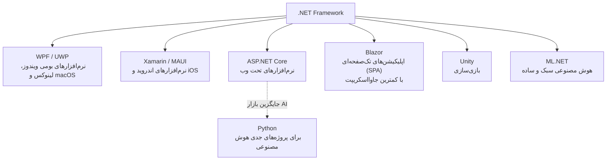

# سخنی با سردبیر نشریه

من هادی فخیمی هستم، سردبیر نشریه‌ی علوم کامپیوتر دانشگاه دامغان و فعال در حوزه‌ی برنامه‌نویسی دات‌نت. می‌خواهم بدون به‌کار بردن هیچ اصطلاح تخصصی یا فنی، با شما دوستان عزیزی که این مقاله را می‌خوانید صحبت کنم.

اجازه دهید با این پرسش شروع کنم: دقیقاً چه نوع تخصص و حوزه‌ای مد نظر ماست؟ اما راستش را بخواهید، من بیشتر به این فکر می‌کنم که این موضوع صرفاً به کاری که انجام می‌دهیم — چه به‌عنوان برنامه‌نویس و چه به‌عنوان متخصص فناوری اطلاعات — محدود نمی‌شود. همچنین قصد ندارم مثل یک فرد فیلسوف‌مآب به‌دنبال معنایی عمیق و ژرف برای کاری که انجام می‌دهیم بگردم، اگر اصلاً چنین معنایی وجود داشته باشد.

اما یک نکته‌ی بسیار مهم هست: نقشی که شما در زندگی ایفا می‌کنید چیست؟ آیا فکر کرده‌اید به‌عنوان یک انسان چه نقشی دارید و چه داستانی از زندگی خود روایت می‌کنید؟ و مهم‌تر از آن، کارهای شما چه تأثیری بر زندگی دیگران می‌گذارد؟

آیا فکر کرده‌اید اگر از شغلی که در آن هستید هیچ شور و اشتیاقی احساس نکنید، باقی روزهای عمرتان را چگونه خواهید گذراند؟

برای من، نقش و معنا در زندگی همیشه اهمیت زیادی داشته است. وقتی احساس کنید وجودتان ضروری است و با تلاشی صادقانه برای حل یک مسئله، زندگی بسیاری از افراد را آسان‌تر می‌کنید، آن‌گاه متوجه ارزش کار خود خواهید شد. اما همه‌ی این‌ها به این برمی‌گردد که تمایل درونی شما چیست و از زندگی چه می‌خواهید. تا زمانی که ذوق و علاقه‌ی خود را در چیزی پیدا نکنید، مدام در جست‌وجوی زبان‌های برنامه‌نویسی جدید خواهید بود تا ببینید کدام‌یک در بازار کار درآمد بیشتری دارد، یا شاخه‌به‌شاخه خواهید شد و بی‌هدف به‌دنبال فراگیری مهارت‌های گوناگون در این دنیای بزرگ و بی‌انتها خواهید رفت.

سخنانم را با این جمله به پایان می‌رسانم:

> *"In The Shadows Of Uncertainty, Fate Whispers Between Choice And Chance"*

در پایان، این نشریه را تقدیم می‌کنم به کسانی که میل به یادگیری در آن‌ها از بین نرفته و خواسته‌اند فراتر از آن‌چه در سرنوشتشان مقدر شده باشند.

---

## بخش اول: ذهن یک برنامه‌نویس

بهتر است با این شروع کنم که یک برنامه‌نویس چطور فکر می‌کند؛ دست‌کم این برداشتی است که من طی سال‌ها کار روی پروژه‌های مختلف به آن رسیده‌ام.

### مهم‌ترین مهارت: حل مسئله

مهم‌ترین مهارتی که یک برنامه‌نویس باید داشته باشد، این است که همواره به‌دنبال حل مسائل باشد، حتی اگر ساده باشند؛ نه لزوماً برای یاد گرفتن چیزی یا انجام کاری بزرگ. البته اگر چنین دیدگاهی به پیشرفت شما در یادگیری کمک می‌کند، مشکلی نیست. اما مهم‌تر از همه، نحوه‌ی نگاه شماست: کنجکاو باشید، بدانید بسیاری از اتفاقات به چه شکل رخ می‌دهند، و سؤالات درست و دقیقی درباره‌ی چرایی وقوع یک پدیده بپرسید. این کار باعث می‌شود درباره‌ی علل بروز یک پدیده، تحلیل دقیقی داشته باشید.

اما یک هشدار جدی هم بدهم: اگر فکر می‌کنید برای حل مسائل حتماً باید علم ریاضی قوی یا زبان انگلیسی فوق‌العاده‌ای داشته باشید، سخت در اشتباهید. این تصور معمولاً از آن‌جا شکل می‌گیرد که وقتی وارد یک محیط آکادمیک می‌شوید، متوجه می‌شوید به بسیاری از چیزها واقف نیستید؛ و این تأکید بر یادگیری موارد گوناگون، ممکن است شما را از یادگیری دلسرد کند و احساس کنید کافی نیستید. اما با توجه به تجربه‌ام، نیازی نیست این موارد را از ابتدا بلد باشید. آن‌چه واقعاً اهمیت دارد این‌هاست:

- توانایی حل مسئله
- پتانسیل یادگیری سریع
- توانایی وفق‌پیدا‌کردن در این بازار کارِ انعطاف‌پذیر
- توانایی ادامه‌دادن و ناامید‌نشدن، هنگامی که با مشکلات زیادی در پیاده‌سازی یک قطعه کد روبه‌رو می‌شوید

در چنین لحظاتی ممکن است احساس کنید احمق هستید، اما این احساس واقعیت ندارد. واقعیت این است که شما در حال پیشرفت‌کردن و یادگرفتن هستید. اما وقتی احساس کردید همه‌چیز برایتان آسان و راحت شده، بدانید که روزِ افول روحیه‌ی برنامه‌نویسی‌تان فرارسیده است.

### چه چیزهایی واقعاً ضروری‌اند؟

نکته‌ی بعدی این است که یاد بگیرید کدام موارد برای یادگیری مهم‌اند و کدام‌یک برای ادامه‌ی مسیر شما ضروری نیستند. راهکاری که برای رسیدن به چنین بینشی بسیار مؤثر است، این است که یک پروژه را شروع کنید و با موفقیت به پایان برسانید؛ چرا که برای تمام‌کردن پروژه‌ای که برای خودتان تعریف کرده‌اید، مغزتان تمایل پیدا می‌کند موارد غیرضروری را کنار بگذارد و روی موارد بنیادی تمرکز کند.

نکته‌ی مهم دیگر این‌که: اگر می‌خواهید علم کامپیوتر یاد بگیرید، مستقیم سراغ اصل قضیه بروید. برای شروع برنامه‌نویسی، اول دانشمند ریاضی نشوید؛ برای یادگیری دوچرخه‌سواری، دنبال گواهی‌نامه‌ی رانندگی نباشید.

حال که به این شفافیت رسیدیم، این سؤال مطرح می‌شود که از کجا شروع کنیم؟ این یکی از سخت‌ترین مواردی است که بتوان آن را در قالب چند جمله بیان کرد؛ اما در نهایت باید بگویم هر کس مسیر متفاوتی برای شروع دارد و نمی‌توان یک نسخه‌ی کلی برای همه پیچید، چون نگاه افراد به این موضوع متفاوت است. برای من مثلاً این‌طور بود که با HTML رنگ پس‌زمینه‌ی مرورگر را عوض می‌کردم؛ امیدوارم برداشت نشود که آدم بیکاری بودم یا سرگرمی نداشتم! موضوع برای من این بود که کشف می‌کردم با المان‌های بسیار ساده چقدر می‌توان تغییر ایجاد کرد. هر کسی از جایی شروع می‌کند، اما در فصل بعدی با جزئیات بیشتری درباره‌ی نقطه‌ی شروع واقعی و این‌که با وجود هوش مصنوعی و خطرات آن در سال ۲۰۲۶ این مسیر چه شکلی دارد، صحبت خواهم کرد.

### تحمل انزوا و سلامت روان

نکته‌ی بعدی و بسیار مهم این است: آیا می‌توانید مدت زیادی را به‌صورت ایزوله بگذرانید؟ یکی از الزامات این حرفه این است که بخش زیادی از روز را صرف حل خطاها یا همان باگ‌ها کنید؛ باگ‌هایی که مثل حشرات موذی درون گوش شما وزوز می‌کنند. این توضیح را لازم دانستم چون خیلی‌ها به آن اشاره نمی‌کنند، در حالی‌که پس از مدتی فعالیت متوجه‌اش می‌شوید و آن‌جاست که نمی‌دانید آیا در شرایط روحی درستی هستید یا نه.

مهم‌ترین چیز در این حرفه، مراقبت از شرایط روحی است؛ چون این حوزه یک مسابقه‌ی دوی سرعت نیست، بلکه ماراتونی بی‌پایان از فشار روانی است. طبق آمارها، بخش قابل‌توجهی از جامعه‌ی برنامه‌نویسی پس از مدتی فعالیت در این حرفه کنار می‌کشند یا حداقل دچار همان چیزی می‌شوند که به آن «استاک شدن» یا فرورفتن در باتلاق فشار روانی می‌گویند.

بهترین پیشنهاد من: قدم‌زدن، و حفظ دوستان یا همکارانی باانگیزه در این حوزه.

### مرز میان کار و زندگی شخصی

می‌خواهم در ادامه بگویم که برخی جنبه‌های این کار، تفکیک‌شان از زندگی شخصی بسیار سخت‌تر از کارهای دیگر است؛ چون هر روز این کار یک چالش تازه است و بخش عظیمی از ذهن شما را به خود اختصاص می‌دهد. ممکن است راه‌حلی که به‌دنبالش هستید در ساعات کاری به ذهنتان نرسد، بلکه حین پیاده‌روی یا انجام کارهای شخصی‌تان به ذهنتان بیاید؛ و این روند ممکن است — به‌مرور — روی زندگی شخصی‌تان هم تأثیر بگذارد. بسیار مهم است که برای کنترل این روند، هم برای پیشرفت در کار و هم برای زندگی شخصی‌تان راه‌حلی پیدا کنید.

یک نکته‌ی شخصی هم اضافه کنم که شاید ارتباط مستقیمی با موضوع این فصل نداشته باشد، اما چون کمتر به آن پرداخته شده، می‌گویم: از افراد سمی و توهم‌زا فاصله بگیرید. معیار شما در این حرفه — و حتی هر حرفه‌ی دیگری — باید صداقت زیاد نسبت به توانمندی‌های خودتان باشد؛ لطفاً این صداقت را از دست ندهید. این افراد همیشه سعی می‌کنند شما را سرخورده و ناراحت کنند و به شما بقبولانند که کافی نیستید، اما واقعیت چیز دیگری است. لطفاً به‌خاطر حرف این افراد به خودتان آسیب نزنید.

### واقعیت‌های تلخ و شیرین مسیر

یک تجربه‌ی دیگر هم بگویم: در این مسیر، یا هر مسیر دیگری که قدم بردارید، متوجه بسیاری از واقعیت‌ها می‌شوید. آدم‌هایی که رویشان خیلی حساب باز می‌کردید و فکر می‌کردید افراد مهمی برایتان هستند، ممکن است پشتتان را خالی کنند و به شما ضربه بزنند. اما بدانید این هم بخشی از زندگی است، و زیبایی زندگی و مسیری که برای موفقیت خودتان انتخاب کرده‌اید همین است: متوجه‌ی ارزش انسان‌هایی می‌شوید که شاید تا دیروز قدرشان را نمی‌دانستید، و حتی تجربه‌هایی که شاید در آن لحظه دردناک بوده‌اند، در نهایت شما را برای لحظه‌ای آماده می‌کنند که هم از نظر شخصیت کاری و هم شخصیت فردی به پختگی می‌رسید. ناامید نشوید و ادامه دهید؛ چون اگر مسیری را که در آن قدم گذاشته‌اید ادامه ندهید، یعنی برای هیچ چیز تلاش کرده‌اید و به خودتان خیانت کرده‌اید.

### اهمیت کارآموزی در یک محیط حرفه‌ای

عنوان بعدی که برای شما در نظر گرفته‌ام، از نظر فنی برایم یک نقطه‌ی عطف در زندگی‌ام بوده است: پس از مدتی کار و پیاده‌سازی پروژه‌های مختلف، در یک سطح متوقف می‌شوید — هرچقدر هم تلاش کنید. برای جلوگیری از این اتفاق باید تلاش کنید در یک شرکت درست و معتبر کارآموزی کنید؛ چرا که در چنین محیطی با مواردی آشنا می‌شوید که تا پیش از آن با آن‌ها روبه‌رو نبوده‌اید. ذهن انسان تمایل دارد خودش را فریب دهد، به شکلی که متوجه نمی‌شوید دارید پروژه‌هایی بسیار ساده طراحی می‌کنید؛ پروژه‌هایی که برای شروع کارتان مفیدند، اما شما را برای بازار کار واقعی آماده نمی‌کنند. نکته‌ی مهم این‌جاست: در یک محیط رقابتی مثل یک شرکت برنامه‌نویسی، هر روز با چالشی تازه روبه‌رو می‌شوید و این دوره برایتان بسیار پربار خواهد بود. پس پیشنهادم این است که تمام بهره را از چنین موقعیتی ببرید.

لطفاً خودتان را با دیگران مقایسه نکنید — و حتی به این جمله‌ی رایج در کتاب‌های روان‌شناسی زردِ عامه‌پسند هم زیاد دل نبندید که می‌گوید «خودت را با خودِ گذشته‌ات مقایسه کن». این جمله، به گمان من، در زندگی کاری‌ام مرا عقب انداخت؛ چون انسان را در یک چرخه‌ی بسته قرار می‌دهد که «می‌خواهم بهتر شوم»، بدون این‌که مشخص کند چقدر بهتر. واقعیت این است که چنین جمله‌ای باعث فرار از این پرسش می‌شود که «من الان کجا هستم، دیگران کجا هستند، و چه باید بکنم تا به سطح درآمدی آن‌ها برسم؟» برای من بهتر بود که از اطرافم و وضعیت فعلی خودم آگاه باشم تا بتوانم خودم را برای بازار کاری آماده کنم که در آن مهندسان و برنامه‌نویسان باهوش فعالیت می‌کنند.

و لطفاً از این‌که فکر می‌کنید توانایی کمتری از دیگران دارید ناامید نشوید؛ چون بسیاری از این افراد درباره‌ی توانمندی‌های خود مبالغه می‌کنند، مبالغه‌ای که شاید چندان با واقعیت هم‌خوانی نداشته باشد. به‌مرور که سواد شما در این حوزه بالا برود، متوجه‌ی این افراد خواهید شد و می‌توانید میزان صداقتشان را بسنجید. اما تا آن زمان، به قول یکی از دوستانم: «شروع به راه‌رفتن کن، متوجه می‌شوی راه‌رفتنت از دویدنِ خیلی‌ها سریع‌تر است.»

---

## بخش دوم: نکات فنی

### ابزار کار

مانند هر کاری که به ابزار نیاز دارد، توسعه‌ی نرم‌افزار هم ابزارهای خودش را دارد. برای نوشتن و اجرای کد، معمولاً با دو رویکرد اصلی روبه‌رو می‌شوید:

1. **ویرایشگر متن (Text Editor):** مانند VS Code؛ سبک و راحت، و با نصب افزونه‌های مختلف می‌توانید کار برنامه‌نویسی را برای خود ساده‌تر کنید.
2. **محیط توسعه‌ی یکپارچه (IDE):** مخفف *Integrated Development Environment*؛ انتخابی حرفه‌ای‌تر برای پروژه‌های در مقیاس تولید (Production) که ابزارهای پیشرفته‌تری برای دیباگ و بررسی کد در اختیارتان می‌گذارد. برای دوستانی که علاقه‌مند به فعالیت در حوزه‌ی دات‌نت هستند، ابزار فوق‌العاده‌ی مایکروسافت یعنی Visual Studio را پیشنهاد می‌کنم؛ همین حالا که این متن را آماده می‌کنم، نسخه‌ی ۲۰۲۶ آن در دسترس است.

درباره‌ی پیکربندی کامپایلرِ زبان‌های مختلف صحبت نمی‌کنم، چون باید یاد بگیرید چطور خودتان نیازهایتان را برطرف کنید. حال این سؤال پیش می‌آید: چگونه؟ به نظر من بهترین منبع برای یادگیری هر ابزار، زبان یا تکنولوژی، مطالعه‌ی مستندات رسمی همان ابزار است. این توضیح شاید کوتاه به‌نظر برسد، اما اگر واقعاً این کار را انجام دهید، می‌بینید که چقدر جلوتر از کسانی هستید که چنین کاری نمی‌کنند.

### با خطاها دوست شوید

بخش بعدی این است که باید هر خطا یا باگی را که با آن روبه‌رو می‌شوید، بررسی و تحلیل کنید و بدانید چرا آن خط‌های قرمز ظاهر شده‌اند. منظورم خطاهای نحوی (Syntax Error) نیست؛ واضح است هر زبانی شیوه‌ی نگارشی مخصوص به خود دارد که باید رعایت شود تا کد اجرا شود. منظورم این است که ممکن است هنگام اجرای برنامه با پدیده‌هایی مثل کرش‌کردن یا خطاهای زمان اجرا (Runtime Error) روبه‌رو شوید؛ پس باید با انواع مختلف این خطاها و ماهیتشان آشنا شوید — از سرریزشدن داده (Overflow) گرفته تا استثنای مقدار خالی (Null Exception) و موارد مشابه.

شاید بپرسید که آیا باید همه‌ی این‌ها را جداگانه مطالعه کرد؟ واقعیت این است که نباید برای هر کار دیدگاه پیش‌نیازی داشته باشید، چون همین دیدگاه باعث می‌شود متوقف بمانید. من شخصاً دو رویه را دنبال می‌کنم:

- هر خطایی را که با آن مواجه می‌شوم یادداشت می‌کنم، علتش را تشخیص می‌دهم و در کنار نوع همان خطا یادداشت می‌کنم.
- برای حل سریع‌تر مشکل، از ابزارهایی مثل دیباگر استفاده می‌کنم تا بفهمم دقیقاً کجای منطق برنامه‌ام ایراد دارد.

### هر برنامه‌ی خوب، از کاغذ شروع می‌شود، نه از کد

فرض کنید آن برنامه فرزند شماست و برای آینده‌اش روی کاغذ برنامه‌ریزی می‌کنید: چه نوع پایگاه‌داده‌ای استفاده می‌شود؟ چه طراحی‌ای برای هر مسیر فراخوانی تابع در نظر گرفته‌اید؟ برنامه‌ی شما به چه Use Caseهایی پاسخ می‌دهد؟ چند کاربر همزمان قرار است از آن استفاده کنند؟ برای مثال، برنامه‌ای که به‌طور موازی ۱۰۰ درخواست کاربر را پردازش می‌کند، از زمین تا آسمان با برنامه‌ای که یک‌میلیون درخواست را پردازش می‌کند فرق دارد. آیا سیستم باید به‌صورت بسته طراحی شود؟ آیا در آینده توسعه خواهد یافت؟

این طراحیِ روی کاغذ، زمان مناسبی به شما می‌دهد تا کروکی‌ای از کاری که می‌خواهید پیاده‌سازی کنید داشته باشید. بسیار مهم است که به جنبه‌های مختلف کار دقت کنید، چون وقتی کار جلوتر برود، دست شما برای تغییرات بسته‌تر خواهد شد؛ و هر تغییر یا بازنویسی، هزینه‌ای — چه مالی و چه زمانی — به همراه دارد که اصلاً مطلوب نیست. پس پیش از هر پیاده‌سازی، همه‌ی جوانب را در نظر بگیرید.

یک برنامه‌نویس حرفه‌ای همچنین از ابزارهای کنترل نسخه استفاده می‌کند تا سیر تکاملی نرم‌افزارش را به‌دقت ثبت کند، یا در صورت نیاز به کدهای قبلی بازگردد (Rollback). چون در یک پروژه‌ی واقعی ممکن است حین توسعه بخش‌هایی حذف یا اضافه شود، پس لطفاً به‌طور حرفه‌ای با این ابزارها آشنا باشید. پیشنهاد من استفاده از Git و GitHub است، چرا که اکثر سازمان‌ها و شرکت‌ها برای مدیریت کد خود از همین ابزارها استفاده می‌کنند.

### هیچ زبان برنامه‌نویسی برتری وجود ندارد

یکی از اشتباهات رایج تازه‌کارها در ابتدای مسیر یادگیری این است که فکر می‌کنند باید یک زبان را انتخاب کنند و برای باقیِ عمر کاری‌شان به همان زبان متکی بمانند. این تصور اشتباه است. نکته‌ی اول این‌که هر زبانی برای هدفی خاص ساخته می‌شود: برخی زبان‌ها همه‌منظوره (General Purpose) هستند و برخی دیگر دقیقاً روی یک زمینه‌ی خاص تمرکز دارند؛ برای مثال، یکی از مهم‌ترین تمرکزهای زبان فرترن (Fortran) پردازش موازی است. اما زبان‌های همه‌منظوره برای یک کاربرد خاص ساخته نشده‌اند و می‌توان از آن‌ها برای کارهای گوناگون، از برنامه‌نویسی وب و هوش مصنوعی تا بازی‌سازی، استفاده کرد.

نکته‌ی مهم دیگر این است که ببینید بازار هدف شما چیست و در آن بازار از چه زبانی برای توسعه‌ی نرم‌افزار استفاده می‌شود، و این‌که آیا آن زبان کامیونیتیِ قوی دارد — یعنی برنامه‌نویسانی متناسب با حوزه‌ی کاری شما در سایت‌های پرسش‌وپاسخ فعال هستند تا بتوانید مشکلاتتان را با آن‌ها در میان بگذارید و به کمک هم حلشان کنید. همچنین ببینید آن زبان در حوزه‌ی کاری موردنظرتان چه پشتیبانی‌ای دارد؛ برای مثال، کمتر کسی سراغ ++C برای توسعه‌ی نرم‌افزارهای سمت وب می‌رود، اما بسیاری از هسته‌های پیاده‌سازی بازی‌ها از کد ++C بهره می‌برند.

مهم‌ترین موضوع این است که ببینید با کدام زبان برنامه‌نویسی خو می‌گیرید و نگران نبودنِ کار برایتان نباشید؛ چون بسیاری از زبان‌هایی که شاید به‌نظرتان منسوخ برسند، همچنان در بازار کار به‌کار گرفته می‌شوند. نکته‌ی مهم این است که آن زبان‌ها یا فریم‌ورک‌هایی که از آن‌ها بهره می‌برند، جواب خود را در عمل پس داده‌اند و اعتماد شرکت‌ها و مشتریان به آن‌ها بیشتر از یک تکنولوژی جدید و ناشناخته است. پس بازار کار روند کاملاً متفاوتی نسبت به محیط‌های آکادمیک — که در لبه‌ی فناوری (Edge of Technology) حرکت می‌کنند — دارد.

نمونه‌ای که خودم به‌وضوح دیده‌ام: پروژه‌ای پیش‌تر با زبان Go نوشته شده، اما حالا نیاز است یک‌سری قابلیت به آن اضافه شود. برای شرکت مهم است که این کار هزینه‌ی زیادی برایش نداشته باشد؛ چون هر تغییر — حتی ارتقا به نسخه‌ی بالاتر همان زبان — نیازمند استخدام برنامه‌نویس بیشتر یا صرف زمان بیشتر برای افزودن ویژگی‌های تازه است، و این یعنی هزینه‌ی اضافه‌ای که برای شرکت خوب نیست. پس تمایل بیشتری دارند به یک برنامه‌نویس Go تکیه کنند تا این‌که یک برنامه‌نویس PHP، سی‌شارپ یا پایتون را برای بازنویسیِ کل نرم‌افزار استخدام کنند. پس بدانید که حتی در سال ۲۰۲۶ هم هنوز به برنامه‌نویسان Go نیاز داریم.

### مفهوم مهم‌تر از سینتکس است

یکی از مهم‌ترین اشتباهاتی که اکثر تازه‌واردها به این حوزه مرتکب می‌شوند — و من هم متأسفانه از این قاعده مستثنا نبوده‌ام — این است: مهم نیست شما برنامه‌نویسِ چه زبانی هستید؛ زبان برنامه‌نویسی، هویت شما را تعریف نمی‌کند. پیش از آن‌که برنامه‌نویسِ فلان زبان باشید، شما یک برنامه‌نویس هستید، و مفاهیم در هر زبان برنامه‌نویسی یکسان‌اند. اگر به این مفاهیم مسلط باشید، مهم نیست کدام زبان در بازار کار طرفدار بیشتری دارد و کدام‌یک ندارد.

یک برنامه‌نویس ابتدا باید با انواع ساختارهای کدنویسی آشنا باشد؛ یعنی بداند برنامه‌نویسی شیءگرا چیست، برنامه‌نویسی فانکشنال چیست. همچنین باید به انواع ساختمان داده و الگوریتم واقف باشد. شاید در دنیای امروز زیاد مستقیماً با این مفاهیم سروکار نداشته باشید، اما دانستنشان بینشی به شما می‌دهد که سطح‌تان را از یک برنامه‌نویس معمولی به یک مهندس نرم‌افزار ارتقا می‌دهد.

### یک زبان برنامه‌نویسی، اما خارق‌العاده

بگذارید این بخش را این‌طور شروع کنم: در مسیر یادگیری‌ام واقعاً شیفته‌ی خانواده‌ی زبان‌های C شدم؛ به این دلیل که اجازه می‌دادند خیلی از جزئیات را خودم تعیین کنم، از مدیریت حافظه گرفته تا مدیریت پردازش‌های موازی. اما در عین حال دوست داشتم کدهایم را روی پلتفرم‌های مختلف اجرا کنم؛ منطقی هم بود، چون وقتی مثلاً بازار کارِ وب کم‌رونق می‌شد، بتوانم با کمترین تغییر به سمت توسعه‌ی نرم‌افزارهای موبایل بروم.

پس به‌دنبال زبانی بودم که هم پشتیبانی قوی داشته باشد و هم چندسکویی (Cross-Platform) باشد — که در فصل‌های آینده بیشتر درباره‌اش صحبت خواهیم کرد. در همین جست‌وجو بود که به زبان سی‌شارپ (C#) رسیدم؛ چون این قابلیت را به من می‌داد که برای پلتفرم‌های مختلف کد بنویسم و برنامه‌ام را روی همه‌ی آن‌ها اجرا کنم. همین موضوع باعث شد با فریم‌ورک زیبای دات‌نت آشنا شوم که با پشتیبانی و کتابخانه‌های فراوانش، کار را برایم بسیار راحت‌تر کرد. نکته‌ای که باید اشاره کنم این است که در فصل‌های بعدی، مثال‌هایی که برای توضیح مفاهیم مختلف می‌آورم، با کدهای سی‌شارپ خواهند بود.

اما بگذارید کمی هم از قابلیت‌های فریم‌ورک دات‌نت بگویم:

- با **WPF** یا **UWP** می‌توانید نرم‌افزارهای بومیِ ویندوزی، لینوکسی یا مک‌اواسی بنویسید.
- با **Xamarin** یا **MAUI** می‌توانید نرم‌افزارهای اندرویدی یا iOS بنویسید.
- با **ASP.NET Core** می‌توانید نرم‌افزارهای تحت وب بنویسید.
- برای پیاده‌سازی اپلیکیشن‌های تک‌صفحه‌ای (SPA) که نمونه‌هایشان React، Angular و Vue هستند، می‌توانید با کد سی‌شارپ و در قالب **Blazor** پروژه بنویسید، آن هم با کمترین جاوااسکریپت ممکن.
- همچنین می‌توانید بازی‌سازی را با همین زبان و محیط توسعه‌ی **Unity** تجربه کنید؛ البته برای دوستان علاقه‌مند، **Unreal Engine** را هم پیشنهاد می‌کنم.
- برای کارهای نه‌چندان پیچیده‌ی هوش مصنوعی می‌توانید به **Model Builder** همین فریم‌ورک تکیه کنید؛ فقط توجه داشته باشید اگر می‌خواهید جدی وارد حوزه‌ی هوش مصنوعی شوید، انتخاب درست‌تر شما پایتون است، چون کتابخانه‌های فراوانی برای همین منظور ساخته شده‌اند.

### همیشه بهتر، همیشه در حال بهبود

شاید فکر کنید بهترین سناریو این است که نرم‌افزاری که پیاده‌سازی کرده‌اید بسیار موفق شود. اما واقعیت این است که موفقیتِ برنامه، در واقع بدترین سناریوست! چون آن نرم‌افزار پس از مدتی نیاز به پشتیبانی دارد و برای توسعه‌ی آن باید از الگوهای طراحی (Design Pattern) آینده‌نگرانه بهره برده باشید. یک برنامه‌نویس همیشه این را در نظر می‌گیرد که اولین نسخه‌ی کد، لزوماً بهترین نسخه نیست؛ پس تلاش می‌کند با بازنویسی کد و بررسی ایده‌های کاربردی، سطح کدش را به سطحی حرفه‌ای و درخور سازمان‌های بزرگ برساند.

برای این کار به بازآرایی کد (Refactor) نیاز داریم. برای این‌که بفهمیم این بازآرایی چقدر بهبود ایجاد کرده، با بنچمارک (Benchmark) میزان تأثیر تغییرات را می‌سنجیم؛ همچنین با نوشتن تست‌های گوناگون برای کدمان، آن را پایش می‌کنیم تا مطمئن شویم در تمام سناریوهای محتمل درست عمل می‌کند. درباره‌ی انواع تست‌نویسی، با مثال و به‌طور کامل، در فصل‌های بعد توضیح خواهم داد.

### نوشتن مستندات

یکی از اساسی‌ترین کارهایی که یک برنامه‌نویس انجام می‌دهد، تهیه‌ی مستندات مربوط به پروژه است. چرا؟ چون پس از اتمام کار، شما نسخه‌ی اولیه‌ای از آن پروژه را تحویل داده‌اید، اما ممکن است بعد از مدتی نیاز باشد نسخه‌ی جدیدی از همان برنامه — با یک‌سری تغییرات — بنویسید. در آن لحظه، شما در حال ویرایش چیزی هستید که پیش‌تر ساخته شده، اما ممکن است بخش‌هایی از آن را از یاد برده باشید. کامنت‌گذاریِ درست، ساختاربندیِ درست و مستندسازیِ جامع، باعث تسلط دوباره‌ی شما بر آن پروژه می‌شود.

همچنین می‌توانید برای خوانایی بیشتر و جلوگیری از کد بدبو (Code Smell)، کدتان را به‌شکل خودمستند (Self-Documented) بنویسید. برای مثال، به‌جای این‌که نام متغیرهایتان را به‌صورت `a`، `b`، `c` بنویسید که هیچ چیزی را توضیح نمی‌دهد، آن را این‌طور بنویسید: `lastUserApprovedId`. این نام متغیر کاملاً بیان‌گر «شناسه‌ی تأییدشده‌ی آخرین کاربر» است و خواندن کد را هم برای شما و هم برای برنامه‌نویسانِ پس از شما آسان‌تر می‌کند.