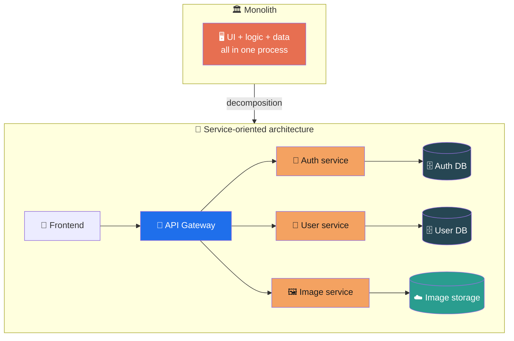
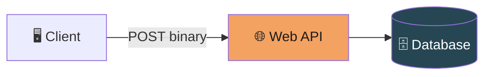
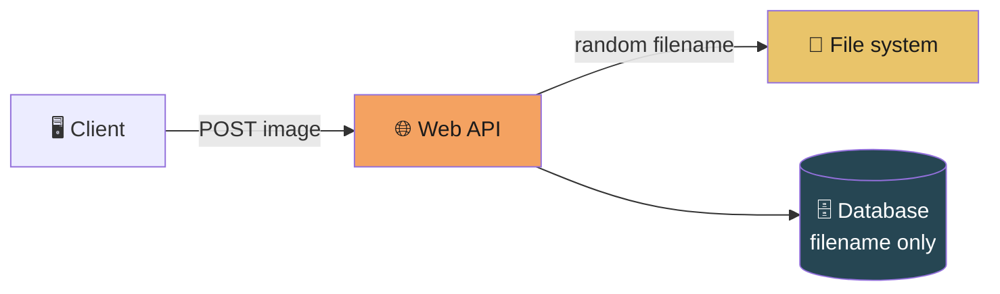
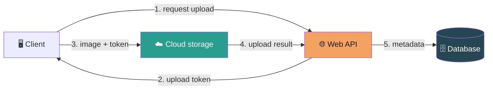
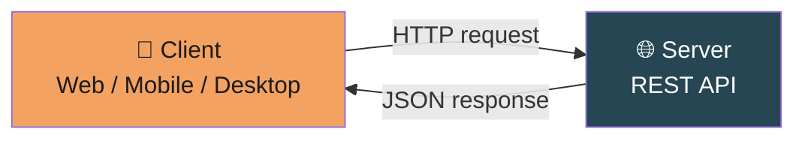
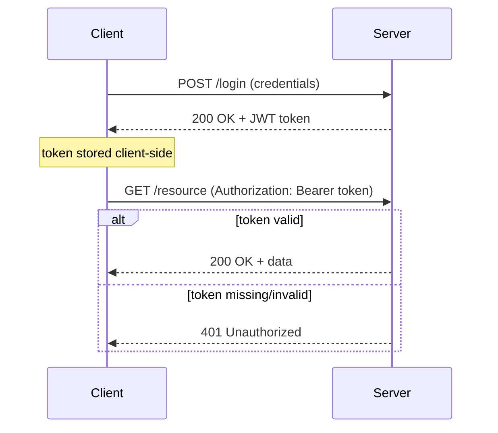
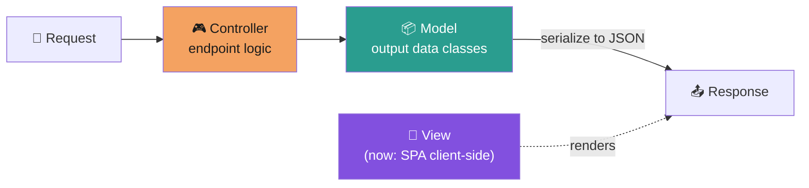
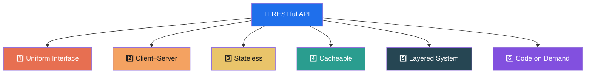
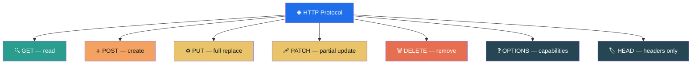
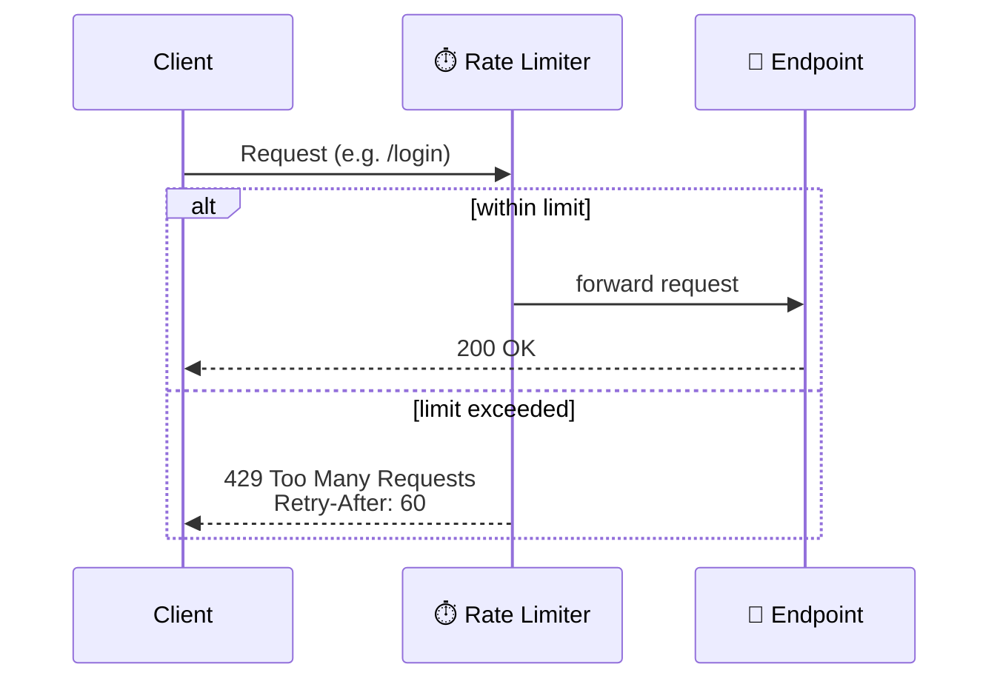

# آشنایی با RESTful API


## مقدمه و شروع ماجرا

خب بهتر است اول با این شروع کنم که من چطور با RESTful API آشنا شدم؛ از آنجایی که من برنامه‌نویس دات‌نت بودم و همچنان هم هستم. اوایل کار خودم بیشتر در این حالت بودم که برنامه‌هایی که به اصطلاح گفته می‌شد «تحت ویندوز» پیاده‌سازی می‌کردم و واقعاً هم لذت می‌بردم از این قضیه، اما کمی بعد به این فکر افتادم که چقدر بهتر می‌شد برنامه‌هایی که می‌نویسم را به این سمت ببرم که دیگران بتوانند با راحتی بیشتر، بدون درگیر شدن با نصب و بدون محدود شدن به سیستم‌عامل خاصی، استفاده کنند و لذت ببرند.

اما فقط این نیت من کافی نبود؛ بلکه شاهد این بودم که اکثر شرکت‌ها تلاش بر این داشتند که به سمت وب‌سرویس‌ها بروند. برای منی که برنامه‌نویس دات‌نت بودم کار سختی نبود، چرا که دات‌نت حتی از پیاده‌سازی وب‌سرویس‌ها پشتیبانی می‌کرد و فقط کافی بود یک سری مفاهیم جدید را یاد بگیرم؛ یکی از آن مفاهیم RESTful API بود.

حالا منی که آن زمان در عالم جهل به سر می‌بردم فکر می‌کردم پکیجی یا وابستگی خاصی هست که باید داخل ریپازیتوری یا محیط کدنویسی‌ام نصبش کنم، اما واقعیت چیز دیگری بود. واقعیت این بود که نه پکیج بود نه چیزی؛ بلکه یک مفهوم بود، یک سبک معماری بود، مثل مفاهیم مختلف و متنوعی که در این علم به وفور پیدا می‌شود.

---

## چرا اصلاً به وب‌سرویس نیاز داریم؟



حالا بهتر است کمی فنی‌تر به این قضیه نگاه کنیم تا ببینیم اصلاً این RESTful API که می‌گویند چه مفهومی پشتش هست و چه کمکی به ما می‌کند.

قبل‌تر که کمتر وب‌سرویس‌ها استفاده می‌شدند، بیشتر به این شکل بود که کدهای فرانت در سرور رندر می‌شد و در نهایت مقادیر رندرشده توسط سرور به کلاینت (یعنی کاربری که نتایج را در مرورگر می‌دید) ارسال می‌شد.

اما در علم مهندسی نرم‌افزار، با رشد نیازها و افزوده‌شدن قابلیت‌های مختلف به نرم‌افزارها، کدبیس‌ها در حال توسعه شلوغ می‌شدند و عملاً به نقطه‌ای می‌رسیدند که غیرقابل توسعه و افزودن قابلیت جدید می‌شدند. پس مهندسان نرم‌افزار بنا را بر این گذاشتند که به سمت الگوهایی در طراحی بروند که کمتر با پیچیدگی در توسعه نرم‌افزار روبه‌رو شوند؛ پس سعی کردند قسمت **user interface** را از قسمت محاسبات منطقی و دیتا جدا کنند؛ چیزی که امروزه ما به اسم **فرانت** می‌شناسیم.

این اتفاق کمک می‌کرد که نرم‌افزار را به تکه‌های مختلفی به عنوان سرویس تقسیم کنیم که مستقل از هم کار کنند یا بر اساس نتایجی که می‌سازند با هم مکالمه داشته باشند. این قضیه کمک می‌کرد که توسعه نرم‌افزار تمیزتر، با ابهام کمتر و سرعت بیشتر پیش برود و با محدودیت‌های معماری قبلی روبه‌رو نشویم.

این اتفاق نه‌تنها در فرانت، بلکه در بخش محاسبات منطقی و ذخیره‌سازی دیتا هم رخ داد.

### مثال: تکامل ذخیره‌سازی تصاویر کاربران

**ایده اول (باینری در دیتابیس):**
کاربر تصویر خود را به صورت باینری post می‌کند و به صورت باینری در دیتابیس ذخیره می‌شود — البته اگر دیتابیس مورد استفاده اصلاً این اجازه را بدهد! ایده جالبی نیست.



**ایده دوم (ذخیره فایل در سرور، فقط نام در دیتابیس):**
چرا خودمان را درگیر ذخیره باینری در دیتابیس کنیم؟ این روش با محدودیت ذخیره‌سازی و سخت‌شدن واکشی دیتا مواجه است و آن را به ایده‌ای به‌دردنخور تبدیل می‌کند. شاید کار کند، اما در اسکیل‌های بزرگ فاجعه است.
در این ایده، هنگام آپلود تصویر یک نام تصادفی برای آن ساخته می‌شود، فقط همان نام در دیتابیس ذخیره می‌شود و خودِ فایل تصویر در یک پوشه روی سرور نگه‌داری می‌شود. اما محدودیتی دارد: در زمان درخواست‌های بالا، فشار زیادی روی سرور می‌آید، چون داده‌های فایل تصویر باید از gateway وب‌سرویس عبور کند — که اصلاً خوب نیست. مناسب کاربران زیاد و هم‌زمان نیست.



**ایده سوم (سرویس مجزای ذخیره‌سازی فایل / ابری):**
چرا یک فایل static باید از gateway وب‌سرویس خودم عبور کند؟
در این ایده یک سرویس جدا برای ذخیره‌سازی فایل در فضای ابری داریم. جریان کار:
1. درخواست آپلود تصویر به وب‌سرویس داده می‌شود.
2. وب‌سرویس توکنی جهت آپلود تصویر به فرانت (user interface) تحویل می‌دهد.
3. این توکن همراه تصویر به سرویس آپلود تصویر در فضای ابری ارسال می‌شود و تصویر آنجا آپلود می‌شود.
4. نتیجه نهایی به وب‌سرویس ما بازگردانده می‌شود و مقادیری مثل نام تصویر و metadata آن، جهت کنترل بهتر، در دیتابیس ذخیره می‌شود.

مزیت مهم این روش: مشغولیت کمتر وب‌سرویس، چون وظیفهٔ ذخیره فایل به سرویس دیگری واگذار شده و وب‌سرویس ما بیشتر وظیفهٔ هماهنگی و ذخیره‌سازی دیتا در دیتابیس را دارد.



---

## نیاز به زبان و قرارداد مشترک

با این تفکیک، ما با وب‌سرویس‌های متعددی روبه‌رو شدیم که با هم توسط پروتکل‌هایی در ارتباط بودند؛ یکی از معروف‌ترین این پروتکل‌ها **HTTP** است که خودش بر بستر **TCP** پیاده می‌شود.

حال که بستری برای ارتباط وب‌سرویس‌ها داریم، نیاز به زبانی مشترک داریم تا وب‌سرویس‌های مختلف — حتی اگر یکی با پایتون و دیگری با سی‌شارپ نوشته شده باشد — بتوانند حرف هم را بفهمند و با هم مکالمه کنند. یکی از این زبان‌های معروف **JSON** است (عمداً مخفف آن گفته نمی‌شود تا خودِ مفهوم را بفهمید؛ فقط جالب است بدانید JSON از زبان **JavaScript** نشأت گرفته است).

نکتهٔ دیگر: فرض کنید زبان یکی است، اما به دلیل تفاوت قراردادهای هر وب‌سرویس ممکن است حین مکالمه، ارتباط سرویس‌ها sync نباشد و handshake با خطا روبه‌رو شود.

همین موضوع ما را به عنوان توسعه‌دهنده به سمت قراردادهایی سوق می‌دهد که یکی از آن‌ها **RESTful API** است.

---

## تعریف RESTful API

همانند سایر سبک‌های معماری، REST نیز دارای مجموعه‌ای از اصول و محدودیت‌ها است. اگر یک سرویس این اصول را رعایت کند، به آن **RESTful** گفته می‌شود.

یک Web API یا Web Service که از معماری REST پیروی کند، **REST API** یا **RESTful API** نامیده می‌شود.

### شش مفهوم اساسی RESTful API

#### ۱. رابط یکنواخت (Uniform Interface)

یکی از اتفاقات خوبی که در این کانسپت وجود دارد این است که باعث ساده‌تر شدن معماری و قابل‌فهم‌تر شدن تعاملات بین client و server می‌شود. این کانسپت بر روی چهار نکتهٔ اصلی قرار دارد که باید در نظر گرفت. اما پیش از آن، نکته‌ای که باید در نظر گرفت این است که معماری RESTful API بر روی پروتکل **HTTP** تعریف می‌شود.

**۱.۱ شناسایی منابع (Identification of Resources)**
این قسمت به ما می‌فهماند که هر منبع یا هر سرویسی که با یکدیگر مکالمه‌ای را شکل می‌دهند، باید به هم بفهمانند چه کسی هستند و نامشان چیست، و در سرویس دریافت‌کنندهٔ پیام از مبدأ ریجیستر شده باشند؛ وگرنه ملزم به handshake نیستند.

**۱.۲ دستکاری منابع از طریق نمایش‌ها (Manipulation of Resources Through Representations)**
یعنی «دستکاری منابع از طریق نمایش‌ها». مثال ملموس: می‌خواهم اطلاعاتی از کاربر مدنظرم را در client نمایش بدهم. آیا نیاز است هر آنچه در دیتابیس ذخیره شده را نمایش بدهم؟ بدیهی است که این کار درست نیست. پس در برنامه‌نویسی نرم‌افزار، کلاس‌هایی تحت عنوان **DTO** می‌سازیم و به کمک یک JSON serializer (مثل Newtonsoft) آن را به خروجی JSON تبدیل می‌کنیم؛ فقط اطلاعاتی که مدنظرمان برای نمایش است را خروجی می‌دهیم.

دیتای ذخیره‌شده در دیتابیس:

| Id | Name | Age | Password | CreatedAt |
|---|---|---|---|---|
| 10 | Ahmad | 25 | Ahmad@79 | 2026-07-28 |

اما خروجی که در وب‌سرویس دیده می‌شود:

```
GET /users/10
```
```json
{
    "id": 10,
    "name": "Ahmad",
    "age": 25
}
```

**۱.۳ پیام‌های خوداظهار (Self-descriptive Messages)**
هر request و response بین کلاینت و سرور باید شامل اطلاعاتی باشد که راهنمای ادامهٔ تعامل بین دو سرویس باشد؛ مثل نوع داده، وضعیت اجرا، اینکه آیا احراز هویت لازم است، آیا باید کش شود و مدت‌زمان کش، و همچنین راهنمای نحوهٔ ادامهٔ درخواست در هر سناریو، طوری که نیازی به درخواست جداگانه برای دریافت اطلاعات پیش‌نیاز نباشد. پس REST فقط حامل داده نیست؛ بلکه علاوه بر دیتا، شامل مواردی برای ادامهٔ تعامل دو سرویس هم هست. مثال:

```json
{
    "id": 10,
    "name": "Hadi",
    "links": [
        {
            "rel": "update",
            "href": "/users/10",
            "method": "PUT"
        },
        {
            "rel": "delete",
            "href": "/users/10",
            "method": "DELETE"
        }
    ]
}
```

**۱.۴ ابررسانه به‌عنوان موتور وضعیت اپلیکیشن (Hypermedia as the Engine of Application State – HATEOAS)**
همان‌طور که در مثال قبل دیدیم، هر پاسخ باید شامل دیتایی باشد که به ادامهٔ مکالمه کمک کند. یعنی کلاینت فقط باید URL اصلی را بداند و مسیردهی در بقیهٔ درخواست‌ها باید از طریق خودِ وب‌سرویس ارائه شود. نکتهٔ بسیار مهم این است که این اصل باید درست پیاده‌سازی شود؛ چون اگر این مسیرها از قبل به‌صورت قراردادی و ثابت بین سرویس‌ها مشخص شده باشند، در روند توسعه با تغییر نام یک مسیر، اپ کلاینت کاملاً از کار می‌افتد — که خوشایند نیست. اگر این اصل پیاده‌سازی نشود، عملاً دو سرویس به‌صورت ناخوشایندی به هم وابسته می‌شوند که هر تغییری روند توسعه را کند می‌کند.

#### ۲. معماری کلاینت–سرور (Client–Server Architecture)

پیش‌تر به این نکته اشاره شد که چرا نیاز به تفکیک داریم و چرا این جداسازی‌ها را انجام می‌دهیم. در این اصل REST هم به همین نکته اشاره می‌شود: اگر از معماری REST استفاده می‌کنید، باید در نظر بگیرید که این تفکیک اجتناب‌ناپذیر است. مزایایی که با پیاده‌سازی این اصل به دست می‌آوریم:

- امکان توسعهٔ مستقل Client و Server
- قابلیت انتقال رابط کاربری به پلتفرم‌های مختلف
- افزایش مقیاس‌پذیری
- ساده‌تر شدن نگهداری سیستم

> نکته: البته هنگام توسعه باید دقت شود که قرارداد (Contract) بین Client و Server شکسته نشود.



#### ۳. بدون حالت (Stateless)

به‌طور کلی برنامه‌های تحت وب stateless هستند، اما باید توجه کرد که در روش‌های قبلی که تفکیکی بین server و client نبود، session کاربر در سرور نگه‌داری می‌شد و همین امر stateless‌بودن را زیر سؤال می‌برد.

سؤالی که ممکن است پیش بیاید: سرور بدون دانستن اطلاعات لاگین کاربر چطور می‌فهمد کاربر به این منبع دسترسی دارد یا نه؟ یکی از رویکردهای جالب این است: بعد از لاگین کاربر، اگر کاربر valid تشخیص داده شود، سرور دیتایی شامل دیتای خام و **token** برمی‌گرداند. این token شامل اطلاعاتی است که کاربر باید در هدر هر درخواست ارسال کند تا پاسخ خود را بگیرد؛ اگر این token در هدر ارسال نشود، سرور پاسخ `401 Unauthorized` برمی‌گرداند.

یکی از معروف‌ترین تکنولوژی‌های این token، **JWT** است: دیتایی که سرور پس از احراز هویت تولید می‌کند تا در هر درخواست، بر اساس اطلاعات هویتی استخراج‌شده از آن token، اجازهٔ دسترسی یا عدم دسترسی به آن منبع صادر شود. نکتهٔ مهم این‌که JWTها معمولاً از یک الگوریتم رمزنگاری برای محافظت از دیتای خودشان استفاده می‌کنند.

با این پیاده‌سازی، وضعیت کاربران در سرور نگه‌داری نمی‌شود؛ بلکه در client ذخیره می‌شود. مثلاً در روش‌های گذشته اگر ۱۰۰ کاربر لاگین بودند، وضعیت احراز هویتشان در سرور نگه‌داری می‌شد؛ اما در این روش هر کاربر مسئول نگه‌داری وضعیت لاگین خودش است.



#### ۴. قابلیت کش (Cacheable)

یکی از ساده‌ترین اصول است، اما با رعایت آن پرفورمنس بسیار خوبی از سیستم می‌بینید. اگر به کلاینت بگویید چه داده‌هایی می‌توانند در فلوی سیستم موقتاً ذخیره شوند، کلاینت می‌تواند برای دسترسی به داده‌هایی که تغییر چندانی هم در دیتابیس ندارند، آن‌ها را کش کند تا از درخواست‌های غیرضروری جلوگیری شود، بار زیادی از روی سرور و دیتابیس برداشته شود و سیستم بتواند به‌ازای هر کاربر، به‌صورت موازی، پاسخ‌گویی بیشتری داشته باشد.

#### ۵. سیستم لایه‌ای (Layered System)

اگر معماری سیستم‌های لایه‌ای وجود نداشت، عملاً روند توسعهٔ نرم‌افزار برای ما غیرممکن می‌شد. یکی از مثال‌های ساده در معماری API، معماری **MVC** است که مسئولیت هر بخش را در لایه‌های مختلف نرم‌افزار تفکیک می‌کند:

- **Model**: کلاس‌هایی که دیتای خروجی سیستم درون آن‌ها قرار می‌گیرد تا پس از تبدیل به خروجی JSON توسط API قابل نمایش باشد.
- **View**: با ظهور SPAها و پیاده‌سازی‌های تفکیک‌شده، این لایه به کلاینت منتقل شده؛ در گذشته فایل‌های HTML بودند که قرار بود توسط موتور رندر، رندر شوند.
- **Controller**: شامل منطق endpointها؛ مسیرهایی که برای دریافت درخواست پیاده‌سازی می‌شوند.

> معماری لایه‌ای به همین‌جا ختم نمی‌شود و دنیای بزرگی برای یادگیری دارد؛ در فصل‌های بعدی تلاش می‌شود این کانسپت شیرین به بهترین شکل ممکن توضیح داده شود.



#### ۶. کد بر حسب تقاضا (Code on Demand)

ارسال کد یا بخشی از script، در صورت نیاز، از سمت سرور به سمت کلاینت. مثال جالب: داشبوردهای گزارش‌گیری (reporting). با ارسال درخواست به سرور برای دریافت گزارش، سرویس‌هایی که به دیتابیس شما متصل‌اند، گزارش‌های کاستوم‌سازی‌شده می‌سازند و به‌صورت HTML دیتا را برمی‌گردانند؛ کلاینت هم آن دیتا را داخل تگ `<iframe>` قرار می‌دهد.

---

### نمای کلی شش اصل RESTful API



---

## پروتکل HTTP

خب ما متوجه شدیم که معماری RESTful API بر روی پروتکل HTTP پیاده‌سازی می‌شود؛ اما این پروتکل چیست؟ تعریفی که می‌توان داشت این است: **بستری برای ارتباط بین کلاینت و سرور**. دقت کنید که خودِ HTTP زبانی برای ارتباط نیست، بلکه بستری است برای ارتباط، و دارای متدهایی است که بنا به نیازمان ملزم به استفاده از آن‌ها می‌شویم.



| Method | کاربرد |
|---|---|
| `GET` | دریافت اطلاعات |
| `POST` | ایجاد داده |
| `PUT` | جایگزینی کامل |
| `PATCH` | به‌روزرسانی جزئی |
| `DELETE` | حذف |
| `OPTIONS` | پرسیدن قابلیت‌های سرور |
| `HEAD` | دریافت فقط Header |

این توضیح بسیار خلاصه بود؛ در فصل بعدی این پروتکل را با جزئیات بیشتری تشریح خواهم کرد.

---

## محدودیت نرخ درخواست (Rate Limiting)

یکی از مباحث جالب و مهمی که پیاده‌سازی آن برای یک وب‌سرویس تقریباً الزامی است، **Rate Limiting** است؛ چون نبود این محدودیت در وب‌سرویس شما باعث بالا رفتن آسیب‌پذیری سیستم می‌شود.

فرض کنید مهاجمی با هدف تخریب وب‌سرویس شما، هزار درخواست را در یک لحظه به یکی از endpointهای شما روانه می‌کند. سرویس شما در سیکل اجرای خود تلاش می‌کند پاسخ بدهد و بار زیادی روی سرور می‌افتد که باعث می‌شود منابع شما هرچه سریع‌تر پر شود و سیستم کرش کند و در نهایت down شود. یکی از تمهیداتی که می‌توانیم داشته باشیم این است که محدودیتی برای تعداد درخواست هر IP یا هر user context در واحد زمان تعیین کنیم. به این نوع حملات **Brute Force** گفته می‌شود — هدف آن‌ها معمولاً دستیابی به اطلاعات خاص نیست، بلکه خرابکاری و ایجاد خسارت برای سیستم هدف است.



نحوهٔ پیاده‌سازی، صرفاً جهت آشنایی، در ASP.NET Core:

```csharp
builder.Services.AddRateLimiter(options =>
{
    options.RejectionStatusCode = StatusCodes.Status429TooManyRequests;

    options.OnRejected = async (context, token) =>
    {
        context.HttpContext.Response.Headers["Retry-After"] = "60";
        await context.HttpContext.Response.WriteAsJsonAsync(new
        {
            message = "تعداد تلاش‌های شما بیش از حد مجاز است. لطفاً کمی بعد دوباره تلاش کنید."
        }, cancellationToken: token);
    };

    options.AddPolicy("LoginPolicy", httpContext =>
        RateLimitPartition.GetSlidingWindowLimiter(
            partitionKey: GetClientKey(httpContext),
            factory: _ => new SlidingWindowRateLimiterOptions
            {
                PermitLimit = 10,
                Window = TimeSpan.FromMinutes(2),
                SegmentsPerWindow = 4,
                QueueLimit = 0
            }));

    options.AddPolicy("RefreshTokenPolicy", httpContext =>
        RateLimitPartition.GetFixedWindowLimiter(
            partitionKey: GetClientKey(httpContext),
            factory: _ => new FixedWindowRateLimiterOptions
            {
                PermitLimit = 15,
                Window = TimeSpan.FromMinutes(2),
                QueueLimit = 0
            }));
});
```

در کلاس `Program.cs` که مسئول startup سیستم API ماست، یک سری مقررات یا به‌اصطلاح policy روی endpointهای خود مشخص می‌کنیم؛ مثلاً اینکه کاربر چند بار می‌تواند به endpoint موردنظر درخواست بزند. در این مثال مسیرهای موردنظر `login` و `refresh-token` بوده‌اند، چون این‌ها معمولاً اولین و ساده‌ترین هدف برای این نوع حمله‌اند.

با استفاده از این صفت روی متدهای controller مشخص می‌کنیم کدام policy روی آن controller اعمال شود:

```csharp
[EnableRateLimiting("LoginPolicy")]
```

Rate Limiting برای اهداف زیر بسیار مهم است:

- حفظ عملکرد (Performance) سرور
- توزیع عادلانهٔ منابع بین کاربران و کلاینت‌ها
- جلوگیری از سوءاستفاده‌هایی مانند:
  - حملات Denial of Service (DoS)
  - حملات Brute Force
  - استخراج انبوه اطلاعات (Data Scraping)
  - افزایش ناگهانی ترافیک که ممکن است باعث از کار افتادن سیستم شود

دقت داشته باشید این موضوع زمانی اهمیت بیشتری پیدا می‌کند که وب‌سرویس‌ها بر اساس پاسخی که می‌دهند، پولی (Pay Per Call) یا سهمیه‌ای (Quota) هزینه دریافت می‌کنند.

> به‌طور کلی در این مقاله سعی بر این بوده که با موارد متنوع و مسائل جالب این حوزه آشنا شوید — نه یادگیری کامل مفهوم، بلکه صرفاً آشنایی هرچه بهتر.
