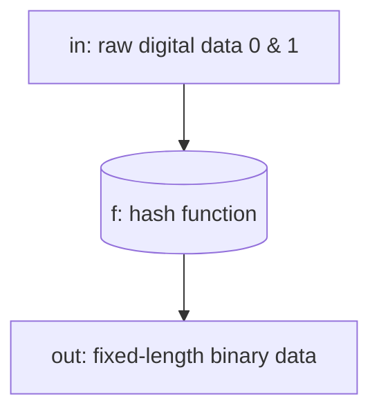

# الگوریتم هش چیست – What is the hash algorithm
احتمالا نام هش (hash) را در کامپیوتر ها و صنعت بلاکچین شنیده اید اما شاید نمی دانستید که در دنیای دیجیتالی امروزی، تقریبا هر جا صحبت از امنیت اطلاعات می شود در واقع غیر مستقیم داریم در مورد الگوریتم های هش و الگوریتم های رمزنگاری صحبت می کنیم! زیرا در دنیای فناوری امروزی این الگوریتم ها ستون های امنیت دیجیتالی و امنیت سایبری هستند و جز حیاتی ترین ابزارهای دنیای امروزی هستند، بدون انها امنیت شبکه های اینترنتی، بانکداری الکترونیک، شبکه های بلاکچین و هر انچه که به امنیت دیجیتالی (digital security) گره خورده در یک چشم به هم زدن فرو می ریخت.

مسئله را با کمی تشبیه برای شما روشن می سازیم: در دنیای فیزیکی ما ادم های مختلف را با اثر انگشت و چهره شان شناسایی می کنیم. مهم نیست چقدر چاق یا لاغر باشند یا مدل موهایشان متفاوت باشد یا عینک بزنند و تغییر قیافه دهند و لباس متفاوتی بپوشند و ... در هر صورت اثر انگشت و حالت صورت شما همیشه یکسان و منحصر به فرد است، الگوریتم های هش هم یک همچین کاری را در دنیای دیجیتالی-کامپیوتری برای داده ها و اطلاعات انجام می دهند، یعنی به دنبال ویژگی های ثابت و قابل اثباتی هستند تا هویت یک داده را از طریق ان به تایید و اثبات برسانند (ان داده می تواند انواع مختلفی از داده ها باشد: متن، عکس، ویدیو و ...)، الگوریتم های هش هر نوع داده باینری را (از یک حرف ساده گرفته تا یک فایل ویدئویی چند گیگابایتی) را دریافت کرده و پس از انجام محاسبات پیچیده ریاضی، یک رشته خروجی با طول ثابت (مثلا 128 رقمی) تولید می کنند، این خروجی را هش کد (hash code) یا دیجست - digest (مجموعه ای از کارکتر های عددی و حروف) می نامیم، که اصل داستان بر روی ان می چرخد.

📍می توانید خیلی ساده در نظر بگیرید که هش ها (hash) توابع پیچیده ریاضی هستند! اگر چه نوع خاصی از توابع ریاضی هستند اما مانند انها به ازای یک ورودی یک خروجی تولید میکند

اما قبل از اینکه الگوریتم های هش را توضیح دهیم بایستی ابتدا کمی در مورد انواع شیوه های رمزنگاری بدانید، در کل علم رمزنگاری یک شاخه کاربردی و جالب از ریاضیات است ما قصد توضیح تاریخچه و روند به وجود امدن و شکل گیری این علم را نداریم، اما اگر علاقه مند هستید و می خواهید بدانید چرا؟، می توانید یک نگاهی به صفحه زیر بیاندازید:

🧷link: https://en.wikipedia.org/wiki/Cryptography 

# علم رمزنگاری چیست؟
علم رمزنگاری یا cryptology: دانشی میان رشته ای است از ترکیب ریاضیات کاربردی – علوم کامپیوتر – سیستم های دیجیتالی و مخابراتی است، این علم به مطالعهٔ روش های ریاضی و الگوریتمیک برای تأمین امنیت اطلاعات در حضور رقبا (دشمنان) می پردازد و چهارچوبی رسمی برای طراحی، تحلیل و نقد پروتکل هایی ارائه می دهد که وظیفهٔ حفاظت از محرمانگی، یکپارچگی، احراز هویت و عدم انکار داده ها را در سیستم های مخابراتی و رایانه ای را بر عهده دارند.

📌یک مثال جالب برای موضوع امنیت، بازی دزد و پلیس یا موش و گربه است، هر طرف سعی میکنند که دست بالاتر را پیدا کنند و البته اخر سر هم هیچ کدام اول نمی شوند، مثالا در بازه ای دزد ها امکان و راه شکستن و یا نفوذ به یک قفل یا سیستم امنیتی را پیدا میکنند، در گام بعدی پلیس ها دست به کار میشوند و نقص های امنیتی را برطرف میکنند یا سیستم ها و قفل های جدید تر و سخت تری را طراحی میکنند تا توسط دزد ها شکسته نشود و این چرخه به همین صورت ادامه دارد.

📍جالبی این موضوع در جایی است که کسی که طراح یک قفل است خودش هم بایستی قفل شکن ماهری باشد تا قفلی بسازد که خودش هم نتواد ان را باز کند و عکس ان نیز برقرار است.

**حال در علم رمزنگاری نیز همچین داستانی وجودی دارد، یعنی علم رمزنگاری هم دقیقا از دو بخش درون خود تشکیل شده است (این تفکیک، تکمیل کننده تعریف ما از این علم است):**
1.رمزنگاری (cryptography): شاخهٔ سازنده این علم است و به نوشتن و طراحی الگوریتم ها، پروتکل های امنیتی و سیستم های امنیتی می پردازد - هدف: ساختن قفل های ریاضیاتی است که شکستن آنها سخت باشد، دانشمندان این حوزه رمزساز هستند

2.رمزشکافی (cryptanalysis): شاخهٔ ویرانگر اما ضروری این علم است و به مطالعهٔ روش های شکستن و نقض سیستم های رمزنگاری می پردازد - هدف: پیدا کردن نقاط ضعف قفل های امنیتی و تلاش برای باز کردن آنها بدون کلید است، دانشمندان این حوزه رمزشکن هستند

به عبارت دیگر برای این که تعریف این علم را کامل کنیم، علم رمزنگاری (cryptology) = دانش رمزنگاری (cryptography) + دانش رمزشکافی (cryptanalysis) است، به عبارتی تا زمانی که یک سیستم رمزنگاری ساخته شده توسط رمزشکاف ها به طور گستره مورد حمله و ازمایش قرار نگیرد و سالم بیرون نیاید، نمی توان ان را یک علم کامل دانست، علم رمزنگاری نیز به همین صورت است و همواری در کشاکش بین (رمزسازی) و (رمزشکافی) تعریف می شود و معنای کامل خود را بدست می اورد.

## انواع شیوه های رمزنگاری
الگوریتم های رمزنگاری (cryptographic algorithms) بر اساس معیارها و ویژگی های مختلفی نظیر نوع کلید، نحوه پردازش داده، اهداف امنیتی و ساختار ریاضی دسته بندی می شوند، ما انها را ذکر میکنیم که فقط بدانید که دیدگاه های برسی و معیار ها مختلف و زوایای متفاوتی دارند اما تنها به دیدگاه اول می پردازیم که مهم ترین دیدگاه برای اشنایی اولیه شما با انواع شیوه های رمزنگاری است:

1.دسته بندی بر اساس نوع کلید (key type) <- که مد نظر ما برای توضیح به شما است در این جا ما یک سلسه کلی از انواع روش های رمزگذاری را معرفی و به طور مختصر برایتان توضیح می دهیم تا فقط ببینید که الگوریتم های هش دقیقا در کجای این علم قرار دارند و به باقی موارد نمی پردازیم.

2.دسته بندی بر اساس نحوه پردازش داده ها (processing method)

3.دسته بندی بر اساس اهداف امنیتی (security objective)

4.دسته بندی بر اساس نوع و پیچیدگی ریاضیات (mathematical complexity)

و دسته بندی های دیگر ...

**بر اساس نوع کلید (key type) انواع الگوریتم های رمزنگاری را به 3 دسته زیر تقسیم می کنیم:**

### 1.الگوریتم های رمزنگاری متقارن / کلید محرمانه (symmetric cryptography)
در این روش از یک کلید یکسان و محرممانه (یکسان یعنی هم برای هر دو عملیات رمزنگاری و رمزگشایی) و محرمانه استفاده می شود و اسم دیگر انها را الگوریتم های کلید متقارن (symmetric-key algorithm) هم می نامند. سرعت اجرای بالایی دارند و برای رمزگذاری حجم زیادی از داده ها مناسب هستند.

📍مثال های کاربردی این الگوریتم:

1.رمزنگاری ترافیک اینترنت در شبکه های بیسیم همان رمز Wi-Fi که در دستگاه خود وارد میکنید، دقیقا همان کلید محرمانه است، در تنظیمات شبکه Wi-Fi یا Hotspot خود نیز با ان مواجه شده اید.

2.رمزگذاری داده های موجود در هارد ها و درایو های ذخیره سازی اطلاعات، مثل ابزار BitLocker در سیستم عامل ویندوز، اطلاعات شما در یک درایو رمزنگاری می شود و برنامه به شما یک کلید محرمانه می دهد و کپی از ان را در ماژول امنیتی کامپیوتر خود نگه می دارد؛ در هنگام خاموش بود دستگاه کسی نمی تواند به داده های شما دسترسی پیدا کند مگر این که ان کلید را داشته باشد یا اینکه بتواند الگوریتم رمزنگاری ان را که AES است را بشکند.

3.فایل های فشرده یا ارشیو شده که بر روی انها رمز می گذارید، برای شما پیش آمده که یک فایل فشرده را با پسورد قفل کرده ای تا برای کسی ایمیل کنی یا در فضای ابری بگذاری تا کسی که پسورد ان را دارد فقط بتواند ان فایل ارشیو را باز کند.

4.در ابزار های تغییر IP (VPN ها و پروکسی ها) نیز ممکن است چنین چیزی را دیده باشید.

نحوه کار انها هم بسیار ساده است؛ یک کلید مشترک که هم داده با ان رمزنگاری می شود هم رمزگشایی


همچین عکسی مد نظر دارم❗

📍مثال هایی از الگوریتم های رمزنگاری متقارن: AES, ChaCha20, DES, 3DES, Blowfish, Twofish, Serpent, RC4, Camellia, Salsa20, IDEA, CAST5, Skipjack, Kuznyechik, Safer, Threefish, …

### 2.الگوریتم های رمزنگاری نامتقارن / کلید خصوصی و کلید عمومی (asymmetric cryptography)
در این روش از یک جفت کلید مرتبط به هم با نام های کلید عمومی (public key) برای رمزنگاری و کلید خصوصی (private key) برای رمزگشایی استفاده می کند، پیچیدگی ریاضی انها بالاتر که به معنای امنیت بیشتر انها است اما سرعت کمتری نسبت به روش متقارن دارد، به همین دلیل در مکان هایی که اولویت انها امنیت حداکثری است از این شیوه استفاده می شود.

📍مثال های کاربردی این الگوریتم:

1.در صفحات وب (خصوصا در پروتکل HTTPS که در انجا TLS/SSH به ان نیاز دارد)

2.امضا های دیجیتالی (digital signature)

3.ارسال پیام های محرمانه کاربر به کاربر (end-to-end) مثالا در اپلیکیشن های پیام رسان سیگنال (signal)، تلگرام (telegram) در حالت چت خصوصی و واتساپ (whatsapp)

4.مدیریت remote desktop ها که از لایه امنیتی SSH key استفاده می کنند.

5.شبکه های بلاکچین و رمز ارز ها در هنگام تراکنش ها و ...


نحوه کار این الگورتیم کمی پیچیده تر است؛ در اینجا در دو مرحله جدا از هم رمزنگاری و رمزگشایی داریم، یک کلید عمومی است که همه می توانند ان را داشته باشند (دقت کنید می توانند داشته باشند نه لزوما) اما کلید خصوصی تنها در دست کاربر است.


یک عدد غیرقابل پیش‌بینی (معمولاً بزرگ و تصادفی) برای شروع تولید یک جفت کلید قابل قبول و مناسب برای استفاده توسط یک الگوریتم کلید نامتقارن استفاده می‌شود.


در این مثال، پیام با کلید خصوصی آلیس به صورت دیجیتالی امضا شده است، اما خود پیام رمزگذاری نشده است. ۱) آلیس پیامی را با کلید خصوصی خود امضا می‌کند. ۲) باب با استفاده از کلید عمومی آلیس می‌تواند تأیید کند که آلیس پیام را ارسال کرده و پیام تغییر نکرده است.


در طرح تبادل کلید دیفی-هلمن، هر یک از طرفین یک جفت کلید عمومی/خصوصی تولید کرده و کلید عمومی این جفت را توزیع می‌کند. پس از به دست آوردن یک کپی معتبر (توجه داشته باشید که این بسیار مهم است) از کلیدهای عمومی یکدیگر، آلیس و باب می‌توانند یک راز مشترک را به صورت آفلاین محاسبه کنند. این راز مشترک می‌تواند، به عنوان مثال، به عنوان کلید یک رمزنگاری متقارن استفاده شود.


در یک طرح رمزگذاری کلید نامتقارن، هر کسی می‌تواند پیام‌ها را با استفاده از یک کلید عمومی رمزگذاری کند، اما فقط دارنده کلید خصوصی جفت شده می‌تواند چنین پیامی را رمزگشایی کند. امنیت سیستم به محرمانه بودن کلید خصوصی بستگی دارد که نباید برای هیچ کس دیگری آشکار شود.

همچین عکس هایی را مد نظر دارم❗

اما اصلا چرا باید این همه کار را سخت کنند؟! بدون دلیل نیست، فرض کنید شما یک فرمانده جنگی هستی و می خواهی یک "فایل دستور محرمانه" را به یک ژنرال در جبهه دیگر بفرستی، در ابتدا از رمزنگاری متقارن استفاده می کنی مثالا کد 1234 که بایستی به طریقی به ان ژنرال برسد (طبیعتا کد هر فایل دستور عملیات هر دفعه عوض می شود) بنابراین نمی شود هر دو فرد ان را حفظ کنند، اما یک مشکل اساسی دیگر هم داری! چطور ان کد را به ژنرال برسانی در حالی که مطمئن باشی جاسوس دشمن ان را در مسیر نمی دزدد؟ اگر کد را با یک کبوتر می فرستی، جاسوس ممکن است کبوتر را بزند و کد را بردارد. اگر با تلفن می گویی، ممکن است خط شنود شود و ... اما اگر از رمزنگاری نا متقارن استفاده شود اصلا نیازی به فرستادن رمز نیست! چه طور؟ فایل دستورات عملیات ها را با رمز عمومی 1234 رمزنگاری می شوند حالا ان ژنرال که کلید خصوصی مختص به خود را دارد مثالا 4321 می تواند ان فایل دستورات عملیات را رمزگشایی کند و بخواند.

📍مثال هایی از الگوریتم های رمزنگاری نامتقارن: RSA, Diffie-Hellman, ECC, DSA, EIgamal, Paillier, Cramer-Shoup, PAKE, YAK, NTRUEncrypt, McEliece, Merkle-Hellman Knapsack

### تفاوت symmetric cryptography با asymmetric cryptography
تفاوت این دو شیوه رمزنگاری را می توان در عکس زیر خلاصه نمود:


همچین عکسی مد نظر دارم❗

### 3.توابع درهم ساز / هش (hash function)
الگوریتم های هش بدون کلید و یک طرفه هستند که ورودی با طول متغیر را به یک خروجی با طول ثابت (Digest) تبدیل می کنند. امکان بازگرداندن داده اولیه از روی خروجی وجود ندارد.


همچین عکسی مد نظر دارم❗

📌مهترین تفاوت در این است که الگوریتم های هش داده ها را به صورت فشرده سازی با اتلاف و غیر قابل برگشت تغییر می دهند چیزی که در دو مورد بالا اتفاق نمی افتاد.

از انجایی که موضوع ما هم در رابطه با الگوریتم های هش است، بنابراین به صورت ویژه به ان می پردازیم

# تعریف یک تابع هش و ویژگی های ان
تابع هش یا تابع درهم ساز (hash) یک نوع خاص از توابع ریاضی است، در ریاضات به انها توابع درهم سازی می گویند (hash functions) کار انها ساده است بدین صورت که هر داده دیجیتالی-باینری (یعنی مجموعه ای از 0 و 1) را به این تابع بدهیم ان را به یک رشته ای با طول ثابت از ارقام و حروف تبدیل می کند.



اما توابع درهم ساز برای اینکه موثر و قابل استفاده در عمل و صنعت باشد به طور حتم بایستی 4 ویژگی اساسی را در خود داشته باشد، یعنی نوع تعریف و روابط ریاضی بین انها که مقدار حاصل را تولید میکند، باید این 4 شرط را ارضا کند:

## 1.خروجی یک تابع درهم ساز بایستی ثابت باشد (fixed length output)
یعنی مهم نیست ورودی چقدر بزرگ یا کوچک باشد در نهایت خروجی تابع هش همیشه یک طول ثابت دارد (مثلا یک رشته 128 یا 256 بیتی از 0 و 1)

## 2.تغییری کوچک در ورودی منجر به تغییری بزرگ در خروجی شود
این ویژگی که در علوم رمزنگاری (cryptography science) به عنوان اثر بهمن (avalanche effect) شناخته می شود را در ابتدا با یک مثال توضیح می دهیم، فرض کنید دو رشته داده داریم: رشته اول با مقدار "Hello" و رشته دوم با مقدار "hello" این دو تفاوت فاحشی باهم ندارند، تنها در یک حرف با هم فرق دارند اما همین تفاوت کوچک در باعث ایجاد یک تفاوت بسیار بزرگ در خروجی حاصل از این دو ورودی می شود! به همین دلیل به ان اثر بهمن می گویند زیرا بهمن نیز می تواند از یک تکانه کوچک شروع شود اما در انتهای مسیر به توده عظیمی از برف تبدیل شود.

📌یک کم کد بزنیم، با یک کد پایتونی اثر بهمن را به شما نشان می دهیم:

```python
#how hash work?
import hashlib    #python hashing library

#our inputs
text1 = 'hello'
text2 = 'Hello'

#converting 8-bit unicode(python 3 defult) to bytecode of 8-bit unicode
encodeText1 = text1.encode('utf-8')
encodeText2 = text2.encode('utf-8')

#parse a text expression into characters and convert each to a binary number
print('show the raw data (binary form) of text 1 & 2 (for each character):')
for ch in text1:
    print(ch, ':', ord(ch), sep='', end='\t')    #ord -> give ASCII binary number of the character

print(end='\n')

for ch in text2:
    print(ch, ':', ord(ch), sep='', end='\t')    #ord -> give ASCII binary number of the character

print(end='\n\n')

#parse a text expression into characters and convert each to a hexadecimal number
print('show the raw data of text 1 & 2 (in hexadecimal form for each character):')
for ch in text1:
    print(ch, ':', hex(ord(ch)), sep='', end='\t')    #hex(ord) -> give ASCII hex number of the character

print(end='\n')

for ch in text2:
    print(ch, ':', hex(ord(ch)), sep='', end='\t')    #hex(ord) -> give ASCII hex number of the character

print(end='\n\n')

#converting to hash (MD5 is 128-bit)
hash_code1 = hashlib.md5(encodeText1).hexdigest()
hash_code2 = hashlib.md5(encodeText2).hexdigest()

#print our output
print("the first word in MD5 hash: ", hash_code1)
print("the second word in MD5 hash:", hash_code2)
```

Program Runtime Result:

```terminal
show the raw data (binary form) of text 1 & 2 (for each character):
h:104   e:101   l:108   l:108   o:111
H:72    e:101   l:108   l:108   o:111

show the raw data of text 1 & 2 (in hexadecimal form for each character):
h:0x68  e:0x65  l:0x6c  l:0x6c  o:0x6f
H:0x48  e:0x65  l:0x6c  l:0x6c  o:0x6f

the first word in MD5 hash:  5d41402abc4b2a76b9719d911017c592
the second word in MD5 hash: 8b1a9953c4611296a827abf8c47804d7
```

📍ایا متوجه تغییرات شدید؟ بین ارقام و کارکتر ها به طور فاحشی اختلاف وجود دارد و به صورتی هم نیست که شما بتوانید به راحتی تغیرات خروجی را حدس بزنید، اما با هر بار اجرای این برنامه هم مشاهده می کنید که رشته ها هم تغییری نمی کنند و صد البته که باید هم اینگونه باشند -> چون اگر خروجی بدون اینکه ورودی تغییری کند، تغییر کند دیگر حتی یک تابع هم محسوب نمیشود (طبق قوانین تابع در ریاضیات) چه برسد به اینکه یک تابع در هم ساز نیز باشد!

## 3.غیر قابل برگشت باشد – یک طرفه بودن (one-way)
این مفهوم یعنی اینکه شما می توانید از داده ورودی به مقدار هش خروجی با سرعتی مناسب برسید، اما هرگز نمی توانید از روی مقدار هش بدست امده از یک داده ورودی بتوانید به داده خروجی بازگردید، که یک جورایی از اسمشان هم مشخص است: درهم سازی معادل مخلوط کردن است - برای تفکیک بهتر ان را مقایسه کنید با الگوریتم های فشرده سازی (compression algorithm) به طور مثال الگوریتم zip که دقیقا بر خلاف الگوریتم های هش باید برگشت پذیر باشند تا شما بتوانید به داده اصلی دسترسی داشته باشید در واقع کار انها کدگذاری (encoding) است اما با این تفاوت که قابلیت کدگشایی (decoding) را هم دارند.

📍با یک مثال ساده می توانیم این مفهوم را توضیح دهیم، هش کردن به نوعی همانند چرخ کردن گوشت یا مخلوط کردن چیز هایی  دیگر است! شما می توانید گوشت را چرخ کنید، اما هرگز نمی توانید از گوشت چرخ شده، دوباره همان تکه گوشت اولیه را بازسازی کنید یا یک مثال دیگر: تا به حال شده که رنگ های مختلف را با هم مخلوط کرده باشید؟ اگر مخلوطی از 2 رنگ را که نسبت ترکیب انها را ندانید و ان را مقابل شما قرار دهند، شما در همان مرحله اول نمی توانید دقیقا بگویید که به طور مثال چند درصد این رنگ ترکیبی از رنگ (الف) ساخته شده و چند درصد دیگر ان حاوی رنگ (ب) است که مجموعا با هم این رنگ ترکیبی را ساخته است، این دقیقا همان مفهوم یک طرفه بودن توابع در همسازی است.

📍 بخش بزرگی از امنیت دستگاه ها – رمزهای عبور - شبکه ها و تراکنش های بلاکچین بر همین مفهوم یک طرفه بودن الگوریتم های هش استوار است، بدون ان عملا تامین امنیت معنا ندارد.

📍بر خلاف تصوری که ممکن است داشته باشید توابع و روابط ریاضی الگوریتم های هش نه تنها پنهان و منبع بسته (close source) نیستند بلکه در دسترس همگان نیز قرار دارند! (به اصطلاح کامپیوتری ها open source هستند)، بنابراین اینجا سوال پیش می ایند که برای چیزی که در دسترس همگان هست چه طور می توانیم از امنیت ان مطمئین باشیم؟ دلیلش بخاطر همین ویژگی سوم توابع درهم ساز یعنی غیرقابل برگشت بودن الگوریتم هش است که باعث امن شدن انها می شوند.

## 4.تا حد امکان در برابر برخورد مقاوم باشد (collision resistant)
اولا اصلا برخورد یعنی چه؟! برخورد در علم رمزنگاری به حالتی گفته میشود یک تابع هش از دو ورودی داده متفاوت مقادیر هش خروجی یکسانی تولید کند! اما یک چیزی مگر نگفته بودیم که این حالت ممکن نیست و خروجی تابع هش باید منحصر به فرد باشد؟ چرا گفته بودیم اما بایستی یک نکته ظریفی را به شما بگوییم درست است الگوریتم های هش بایستی تا حد امکان خروجی های متفاوت و یکتایی تولید کند اما همه این الگوریتم ها هم در نهایت محدودیت های ریاضی مختص به خود را دارند – این را به کمک اصل لانه کبوتری برای شما توضیح می دهیم:

اصل لانه کبوتری (pigeonhole principle) به زبان ساده به ما می گوید: اگر m شئ (کبوتر) را بخواهیم در n ظرف (لانه) قرار دهیم به طوری که m > n باشد (تعداد اشیاء از تعداد ظرف ها بیشتر باشد)، انگاه حداقل یک ظرف (لانه) وجود دارد که در ان 2 شئ (کبوتر) قرار گرفته است.

نسخه تعمیم یافته ان همچنین به ما می گوید: اگر m شئ را در n ظرف بریزیم، انگاه حداقل یک ظرف وجود دارد که ⌈m/n⌉ شیء در ان وجود دارد.

📍علامت ⌈ ⌉ یعنی سقف یا همان گرد کردن رو به بالا.

اگر نخواهیم پیچیده و سختش کنیم می توانید این گونه در نظر بگیرید: برای این که بتوانیم از دو ورودی داده متفاوت به الگوریتم هش مثالا الگوریتم هش MD5 (که خروجی 128-bit یعنی عدد باینری 128 رقمی (مجموعه ای از 128 تا 0 و 1) تولید می کند) را بدهیم و خروجی تابع هش ان یکسان شود از نظر تئوری و بر روی کاغذ بایستی:

 2^128=340,282,366,920,938,463,463,374,607,431,768,211,456 داده ورودی دیجیتالی مختلف را به الگوریتم هش بدهیم!!! تا با اطمینان یک برخورد صورت گرفته باشد (یعنی همان حالتی که دو شئ در یک ظرف بروند)، و نکته جالب ان هم این است که این اتفاق در دنیای واقعی برای الگوریتم هش MD5 افتاده! به همین دلیل هم امروزه استفاده از الگوریتم هش MD5 نسبت به SHA-256 بسیار کمتر شده.

یعنی تصور کنید دائما داده هایی بر روی الگوریتم MD5 (که در سال 1991 معرفی شد) در طول تقریبا 19-20 سال تست شد، تا بلاخره در سال 2004 و 2005 برخوردی برای این الگوریتم هش اتفاق افتاد و باعث تولید شد دو گواهی دیجیتال با هش یکسان تولید شود، نقطه مرگ این الگوریتم نیز در سال 2012 رقم خورد زمانی که افرادی حتی با کمتر از 1 دلار توانستند از سد این الگوریتم رد شوند.

link: https://www.bitdefender.com/en-gb/blog/hotforsecurity/md5-hash-broken-via-collision-attack-of-less-than-1

الگوریتم SHA-1 ساخت اژانس امنیت ملی امریکا (NSA) که در سال 1995 معرفی شد تا سال ها استاندارد رمزنگاری بود تا اینکه سرانجام پس از 23 سال در سال 2017 شرکت گوگل در پروژه ای با نام SHAttered رسما نشاد داد که توانسته دو فایل PDF با محتوای کاملا متفاوت اما با هش تولید شده متفاوت از SHA-1 بسازد! و این قضیه زنگ پایان استفاده از این الگوریتم را به صدا دراورد، خروجی الگوریتم SHA-1 به طور ثابت 160-bit بود. البته دلیل عملی بودن برخورد در SHA-1، استفاده از حمله تولد (birthday attack) بود، نه اینکه مجبور باشیم واقعا 2^160 عدد داده را امتحان کنیم. (چون طبق پارادوکس تولد، برای پیدا کردن برخورد در یک تابع با خروجی n بیت، فقط به حدود 2^(160/2) تا داده نیاز داریم)

link: https://security.googleblog.com/2017/02/announcing-first-sha1-collision.html

# نوشتن یک الگوریتم هش ساده
یک تابع هش ساده را می نویسیم تا قشنگ ببینید که چگونه ورودی ها با استفاده از روابط ریاضی خروجی های یک الگوریتم هش را به وجود می اورند.

📍زبان پایتون را به دلیل سادگی برای نوشتن الگوریتم انتخاب کرده ایم.

```python
#create a simple hash function
def digit_hash(input_text):
    sum = 0
    for ch in input_text:
        #multiply by a larger prime number (like 31 or 131) to increase the impact of the character position
        sum = (sum * 31) + ord(ch)    #ord -> give ASCII binary number of the character

    result = sum % 100000000    #the remainder is divided by 100,000,000, to get 8 digits
    return result

#call our hash function
print(digit_hash('Hello'))
print(digit_hash('hello'))
```

Program Runtime Result:

```terminal
69609650
99162322
```

📍الگوریتم ساده ای که نوشتیم را می توان تا حدی به عنوان یک تابع هش اموزشی پذیرفت، طول خروجی ها ثابت 8 کارکتر است (شرط 1)، تغییری کوچک در ورودی منجر به تغییر بزرگ در خروجی میشود (شرط 2) و برگشت پذیر هم نیست چون تابع ما یک به یک نیست (شرط 3)

اما توجه کنید که این یک تابع هش کامل نیست زیرا شرط نهایی (شرط چهارم) را ندارد -> می پرسید چه طور؟ شما می توانید دو مقدار ورودی پیدا کنید و به این برنامه بدهید و مشاهده کنید که اعداد خروجی که حاصل از این تابع هش دست ساز ما است با هم برابر شده است.

خیلی ساده کافی است به جای این دو رشته Hello و hello انها را با مقدار "AB" و "B#" پر کنید و خواهید دید که مقداری که این الگوریتم هش اموزشی ما تولید کرده با هم برابر می شود – این یعنی یک برخورد صورت گرفته (به همین سادگی)

بنابراین برنامه خود را اینگونه تغییر می دهیم:

```python
#our simple hash function
def digit_hash(input_text):
    sum = 0
    for ch in input_text:
        #multiply by a larger prime number (like 31 or 131) to increase the impact of the character position
        sum = (sum * 31) + ord(ch)    #ord -> give ASCII binary number of the character

    result = sum % 100000000    #the remainder is divided by 100,000,000, to get 8 digits
    return result

#call our hash function with different words
print(digit_hash("AB"))
print(digit_hash("B#"))
```

Program Runtime Result:

```terminal
2081
2081
```

هماطور که مشاهده کردید توانستیم برای الگورریتم هش اموزشی مان یک برخورد پیدا کنیم

📍درواقع به نوعی سخت ترین کار یا سخت ترین شرط برای ساختن یک تابع درهم ساز مناسب همین شرط چهارم توابع درهم ساز است، اینکه چه طور تابع درهم سازیی با روابط مختلف ریاضی بنویسیم که از نظر ریاضی به قدر پیچیدگی داشته باشد تا بتواند این تضمین را به ما بدهد که احتمال پیدا شدن دو مقدار ورودی که خروجی یکسان از تابع هش تحویل ما دهد، به کمترین حد ممکن خود برسد و به سادگی ممکن نباشد! این کار خودش یک مبحث پیچیده و مفصل است، و هنر یک رمزساز ماهر است، به همین دلیل نوشتن توابع درهم ساز کننده ای که بتواند احتمال این قضیه را بسیار پایین نگه دارد دشوار است و به زمان، پژوهش گروهی، مطالعه و ازمایش های فراوان نیاز دارد.

# کاربرد های الگوریتم هش در زندگی روزمره
شاید این فکر را با خود کنید که هش یک مفهوم ریاضی و انتزاعی است و در جایی مثالا آزمایشگاه های رمزنگاری و ریاضی ساخته شده است، درست فکر میکنید! اما روی دیگر و کاربرد محوری هم دارد، واقعیت این است که شما روزانه بارها و بارها بدون اینکه متوجه شوید یا اینکه از نزدیک ان را دیده باشید با انها زندگی می کنید! به همین عنوان کاربرد های مهمی از الگوریتم های هش در زندگی روزمره برای شما مثال می زنیم تا کاربرد انها را در زندگی روزمره خود ببینید.

## 1.ذخیره سازی امن رمز های عبور
طبیعاتا هر کسی که از اینترنت استفاده میکند قطعا حساب هایی برای خود دارد به طور مثال: حساب های تجاری - کاری و شرکتی، حساب های خبررسانی و رسانه ای و یا در وب سایت های مورد علاقه خود عضو و کاربر فعال ان هستند و ... شیوه مرسوم انها برای ورود شما به حساب هایتان در گام اول رمز عبور (password) است، وقتی شما به طور مثال در وب سایتی ثبت نام می کنید پایگاه داده یا مخزن اطلاعاتی که سرور های ان سایت حساب شما را در ان زخیره میکند نباید رمز عبور شما را همینطوری و به صورت خام ذخیره کند، چرا که با یک بار درز اطلاعاتی و هک شدم تمام حساب های کاربران و رمزعبور انها و اطلاعات دیگر ... همه و همه افشا می شوند! در عوض شرکت ها و سازمان ها رمز عبور شما را در ابتدا هش میکنند سپس ذخیره میکنند، بنابراین در دفعات بعدی هر باری که شما رمزعبور خود را وارد می کنید در ابتدا هش (hash) می شود، سپس با نسخه رمزعبور هش شده ای که شما در زمان افتتاح حسابتان ساخته بوده اید و در پایگاه داده یا مخزن اطلاعات ان وب سایت ذخیره شده مقایسه می شود، اگر مشابه هم بودند یعنی رمزعبور شما درست است و اگر مشابه هم نبودند به منزله رمزعبور اشتباه تلقی می شود و در نهایت مانع ورود شما به وبسایت و حساب کاربری شما می شوند.

📍 البته برای امنیت و اهراز حویت شما شرکت ها و سازمان ها از روش های مکمل با رمز عبور مانند رمز پویا بانکی - ارسال پیامک و ایمیل حاوی کد تایید یا ازمون های تشخیص انسان از ربات که به انها کپتچا (CAPTCHA) می گویند و انواع روش های مکمل دیگر ... را استفاده می کنند و تنها به یک رمزعبور اکتفا نمی کنند تا امنیت مشتریان خود را تضمین کنند و یا راه های دیگری برای ورود شما به حساب کاربری در اختیار شما قرار دهند.

📌من پروژه وب خود را با استفاده از همین توابع هش ایمن سازی کردم، موضوع پروژه هم یک دفترچه یاداشت انلاین شبیه به google keep بود، من محلی از پروژه ام را نشان می دهم که در ان هنگامی که کاربر برای رمز عبور حساب خود مقداری را وارد میکند ان را را تبدیل به هش کد (hash code) کرده و در نهایت در پایگاه داده خود ذخیره می کند:

📍کد به زبان جاوا (java) نوشته شده و بخش هایی از ان هم بریده شده تا صرفا مفهوم استفاده از الگوریتم هش را متوجه شوید.

```java
import org.mindrot.jbcrypt.BCrypt;
import java.time.LocalDateTime;
…
//============================================================
/1.Registration service (Logi
//============================================================
public UserModel register(String name, String username, String password) {
    …
    //BCrypt slow hashing algorithm and the output of that will be 60 characters.
    String hashedPassword = BCrypt.hashpw(password, BCrypt.gensalt(12)); //12 is the strength of hashing
    UserModel newUser = new UserModel();
    newUser.setName(name);
    newUser.setUsername(username);
    newUser.setPassword(hashedPassword);
    newUser.setCreationTime(LocalDateTime.now());

    return userRepository.save(newUser);
}
```

📍البته چک کردن ان هم با با متد مختص به خود الگوریتم هش BCrypt انجام می گیرد زیرا نوع این الگوریتم هش با الگوریتم های هش متداول (نظیر MD5 و SHA و ...) متفاوت است.

``` java
import org.mindrot.jbcrypt.BCrypt;
…
public String login(String username, String password) {
    //If we hash the password with common algorithms, the logic of checking it becomes easily possible
    //the entered raw password is compared textually with the hashed password in the database:
    if (!password.equals(user.getPassword())) {
        throw new RuntimeException("The username or password is incorrect.");
    }
    …
    //BCrypt hash check
    //compare the password string with the hash stored in the database:
    if (!BCrypt.checkpw(password, user.getPassword())) {
        throw new UserExceptionHandler.AuthenticationException("Incorrect username or password!");
    }
}
```

📍این موارد اگرچه امنیت کاربران را بهبود می بخشد اما این مسئله که ایا خود شرکت های تجاری و سازمان ها اجازه دارند اصل رمزعبور و یا اطلاعات شخصی شما را داشته باشند یا نه تبدیل به یک مسئله حقوقی بحث برانگیز و پرچالش تبدیل می شود و از محل بحث ما خارج است.

## 2.برسی اصالت فایل های اینترنتی
وقتی فایل های حساس را دانلود می کنید به طور مثال: فایل نصبی یک بازی یا یک برنامه یا یک سیستم عامل لینوکس یا ویندوز و ... طبیعتا برای شما مهم می شود که بدانید "ایا این فایلی که من دانلود کرده ام سالم است و دستکاریی نشده؟" به همین خاطر وبسایت ها و شرکت های ارائه دهندگان نرم افزار معمولا در وب سایت خود یک کد طولانی (عموما 128 رقمی یا 256 رقمی) کنار لینک (link) دانلود فایل خود تحت عنواینی همچون MD5 hash یا SHA-256 و ... قرار میدهند، تا پس از بارگیری (download) ان شما بتوانید با محاسبه کد هش (hash code) که از این فایل دانلود شده بدست می اورید، ان را با نسخه هش کد (hash code) که در ان وب سایت وجود دارد برسی و مقایسه کنید تا از این موضوع اطلاع یابید، ارزیابی این مورد نیز مشابه مورد بالایی است، اگر هش کد شما با هش کد سایت مشابه بود یعنی فایل شما دستکاری و تغییری به خود ندیده و حالت خلاف ان که نشان میدهد فایل شما یک تغییر و دستکاری به خود دیده است.

در عمل: خیلی ساده شما هم می توانید هش فایل هایی که از اینترنت دریافت میکنید و یا خودتان می سازید را برسی کنید، این مورد را دقیق به شما نشان می دهیم و همچنین راه هایی را برای این که خودتان هش کد هر فایلی را در این 3 سیستم عامل رایج در کامپیوتر، چک کنید را به شما پیشنهاد می دهیم:

> **❗هشدار:** قبل از شروع حتما دقت لازم را هنگام کار با محیط های خط فرمان به عمل اورید، زیرا این محیط ها به کوچک و بزرگ بودن حروف – اشتباه نوشتن نام دستورات و ... حساس هستند و همچنین مسیر فایل و نام و پسوند فایل را هم با دقت وارد کنید.

📌 اگر در سیستم عامل ویندوز هستید به ترمینال فرمان ویندوز که CMD باشد وارد شوید، و طبق شیوه اموزش داده شده، کد ها را وارد کنید.

چک کردن هش کد تولید شده از فایل با استفاده از الگوریتم MD5 و SHA-256 در کامپیوتر های ویندوزی:

```bash
# certutil -hashfile [your file path in Windows style] + [file suffix format] MD5
# certutil -hashfile [your file path in Windows style] + [file suffix format] SHA256

# enter the path to your file as it is stored in Windows, including the file type extension -> example:

# for MD5 algorithm
certutil -hashfile "C:\Users\Yousef\Desktop\HashConverting.py" MD5
certutil -hashfile "C:\Users\Yousef\Desktop\hash_algorithms.docx" MD5

# for SHA-256 algorithm

certutil -hashfile "C:\Users\Yousef\Desktop\HashConverting.py" SHA256
certutil -hashfile "C:\Users\Yousef\Desktop\hash_algorithms.docx" SHA256
```

📌اگر در سیستم عامل لینوکس هستید به ترمینال فرمان لینوکس که shell باشد وارد شوید، و طبق شیوه اموزش داده شده، کد ها را وارد کنید

چک کردن هش کد تولید شده از فایل با استفاده از الگوریتم MD5 و SHA-256 در کامپیوتر های لینوکسی:

```bash
# md5sum [your file path in Linux style] + [file suffix format]
# sha256sum [your file path in Linux style] + [file suffix format]

# write the path to your file along with the extension of your file type –> example:

# to check MD5 hash
md5sum /home/Yousef/Desktop/HashConverting.py
md5sum /home/Yousef/Desktop/hash_algorithms.docx

# to SHA-256 hash
sha256sum ~/Desktop/HashConverting.py
sha256sum ~/Desktop/hash_algorithms.docx
```
📍نکته: در کامپیوتر های لینوکسی مسیر /home/[your computer username] معادل علامت (tiled) ~ است (مسیر پوشه خانگی کاربر – user home directory)

📌اگر در سیستم عامل مک هستید به ترمینال فرمان مک که Terminal باشد وارد شوید، و طبق شیوه اموزش داده شده، کد ها را وارد کنید

چک کردن هش کد تولید شده از فایل با استفاده از الگوریتم MD5 و SHA-256 در کامپیوتر های مکینتاش (مشابه دستگاه های لینوکسی با کمی تفاوت در MD5):

```bash
# md5sum [your file path in Mac-OS style] + [your file suffix format]
# md5 [your file path in Mac-OS style] + [your file suffix format]
# shasum -a [number of your SHA hash length] [your file path in Mac-OS style] + [your file suffix format]

# write the path to your file along with the extension of your file type –> example:

# to check MD5 hash:
# the first MD5 method usually works

md5sum /Users/Yousef/Desktop/HashConverting.py
md5sum ~/Desktop/hash_algorithms.docx

# or the second MD5 method (if the first one didn't work):

md5 /Users/Yousef/Desktop/HashConverting.py
md5 ~/Desktop/hash_algorithms.docx

# to check SHA-256 hash

shasum -a 256 /Users/Yousef/Desktop/HashConverting.py
shasum -a 256 ~/Desktop/hash_algorithms.docx
```
📍نکته: در کامپیوتر های مک مسیر /Users/[your computer username] معادل علامت (tilde) ~ است (مسیر پوشه خانگی کاربر – user home directory)

## 3.حوزه بلاکچین و رمز ارز ها
احتمالا تا کنون اسم تکنولوژی زنجیره بلوک (block chain) را شنیده اید و سریع به یاد رمز ارز ها (cryptocurrency) و توکن های غیرقابل تعویض (NFT: non-fungible token) افتاده اید، رمز ارز هایی همانند، بیت کوین (bit coin) و اتریوم (ethereum) و ...، در شبکه هایی مبتنی بر تکنولوژی بلاکچین فعالیت می کنند، هر تراکنش (transaction) در بلوک هایی بسته بندی می شوند (یعنی در بلوک داده های هش شده یک تراکنش وجود دارد) و هر بلوک، شامل مقدار هش بلوک قبلی خود است (بلوک ها به صورت یک توالی پشت سر هم رشد میکنند)، این کار باعث می شود بلوک ها مثل حلقه های زنجیر به هم قفل شوند طوریکه اگر کسی بخواهد یک تراکنش قدیمی را دستکاری کند، هش آن بلوک تغییر کرده و این تغییر با هش ذخیره‌شده در بلوک بعدی همخوانی نخواهد داشت. در نتیجه، آن بلوک و تمام بلوک‌های بعد از آن نامعتبر شده و کل شبکه متوجه تقلب می‌شود، چون درواقع هر بلوک با مقدار ورودی هش شده از بلوک قبلی خود پر شده، به همین دلیل است که این فن اوری به block chain یعنی زنجیره ای از بلوک ها معروف شده.

زمینه های کاربردی این فناوری اگرچه هنوز کاملا تکمیل و پیاده نشده اند اما اکثر متخصصان و تحلیل گران بر این باور هستند که این فناوری اینده درخشانی دارد، از جمله زمینه های ان می توان به: 1.امور مالی و بانکداری (پرکاربرد ترین حوزه این فناوری) | 2.قراردادهای هوشمند(Smart Contracts) | 3.هویت دیجیتال و احراز هویت | 4.حقوق دیجیتالی و مالکیت مجازی در قالب NFT ها برخی از مهم ترین کاربرد های این حوزه هستند – همچنین برخی از کاربرد های نوین تر این فناوری اگرچه بسیار جالب هستند اما هنوز به طور گسترده پیاده سازی نشده اند، حوزه هایی همانند: حسابداری، دعوای حقوقی، مدیریت زنجیره تأمین، هویت دیجیتال، بازی، هنر، پزشکی، انرژی و ... یعنی به طور خلاصه که بگوییم یعنی کاربرد بلاکچین فقط به عنوان پول دیجیتالی محدود نمی شود؛ بلکه به طور کلی هر زمینه ای که نیاز به شفافیت سازی یا امنیت و یا حذف واسطه ها داشته باشیم، فناوری بلاکچین می تواند حضور و کاربرد خوب در ان زمینه داشته باشد.

📍بلاکچین در زمینه های مالی و بانک داری به طور خاص رقیب جدیی برای سیستم بانکی و نظام های مالی سنتی هستند، البته با ورود هوش مصنوعی و تب و تاب اولیه ان برای شرکت ها و سازمان ها کمی رشد این حوزه را کند کرده اما در کل این فناوری می تواند اینده درخشانی داشته باشد.

## 4.کاربرد در برنامه نویسی
احتمالا دانشجویان رشته های کامپیوتری و برق و یا کسانی که دروسی از جمله رمز نگاری یا برنامه نویسی را  داشته باشد با هش (hash) ها مواجه شده اند و کاربردی از ان را دیده اند، اگر با کاربرد مجموعه ها (set) و دیکشنری (dictionary) در زبان python اشنا باشید به احتمال زیاد هم می دانید این ساختار داده ها بسیار مناسب برای جست و جو کردن هستند، دلیل این اتفاق هم به همین ویژگی اول تابع هش باز می گردد، چون مجموعه ها و دیکشنری در زبان های برنامه نویسی این ساختار های داده ای با استفاده از توابع هش پیاده سازی می شوند که به انها جداول هش (hash table) می گوییم، بنابراین جستجو در یک مجموعه خیلی بزرگ مثلا یک مجموعه یک میلیون عنصره، در بدترین حالت هم در کسری از ثانیه انجام می شود و دسترسی سریع به عناصر محقق می شود (البته جزئیات فنی ان باقی میماند اما خب مورد بحث ما نیست)

# انواع رایج الگوریتم های هش
تا اینجا کار شما با مطالعه این مطالب با چند نمونه از الگوریتم های هش معروف و رایج که نابرده بودم مانند: MD5, SHA-1, SHA-256, BCrypt اشنا شده اید، حال وقت ان رسیده که این الگوریتم ها رو دسته بندی کنیم، انواع کلی انها را معرفی کنیم تا دقیق تر بدانید هر کدام از الگوریتم های رایج در کجا و چه زمینه هایی استفاده و کاربرد دارند و یا اصلا متوجه شویم که کدام یک هنوز قابل اعتماد هستند و کدام یک بازنشسته شدن اند و دیگر در صنعت استفاده نمی شوند.

به طورکلی الگوریتم های هش را می توان در سه دسته جامع تقسیم بندی کرد که برای هر کدام از انها توضیحات و مثال هایی را ارائه می دهیم:

## 1.الگوریتم های هش برسی جمع (checksum hash algorithm)
این دسته از ساده ترین و قدیمی ترین توابع هش هستند که هدف اصلی انها شناسایی خطاهای تصادفی (randoms errors detect) در هنگام انتقال و یا ذخیره سازی داده ها است (خطا هایی مانند نویز های شبکه یا خرابی بخشی از دیسک ذخیره کننده و موارد دیگر) این الگوریتم ها برای امنیت طراحی نشده اند بلکه اولویت انها سرعت بسیار بالا و سادگی محاسباتی انها است، در حدی که اغلب این الگوریتم ها مبتنی بر جمع گیری باینری، XOR و جداول جمعی عادی است و برای برسی سلامت فایل ها هنگام انتقال، ذخیره سازی، بارگیری (download) و بارگذاری (upload) به کار می روند، البته توجه کنید که برای برسی سلامت فایل ها هنگام انتقال به کار می روند نه برسی تغییر و یا دستکاری شدن فایل ها و داده ها (این مورد متفاوت از ان چیزی است که در کاربرد های الگوریتم های هش به ان اشاره کرده ایم)

ویژگی کلیدی انها در 1.سرعت بالا | 2.عدم مقاومت در برابر برخورد (collision) | 3.عدم امن بودن

مثال های رایج و پر کاربرد از این الگوریتم ها:

•الگوریتم هش CRC32 (cyclic redundancy check) یکی از پرکاربرد ترین الگوریتم های برسی جمع است و در فایل های zip و عکس های png و پروتکل های شبکه ethernet کاربرد دارد

•الگوریتم هش Adler-32 نسخه ای سریع تر از الگوریتم بالایی است منتهی با دقت پایین تر برای استفاده در کتابخانه های zlib استفاده میشود

•الگوریتم های هش parity bit و checksum-8/16/32 و XOR checksum بسیار قدیمی هستندس

## 2.الگوریتم های هش غیر رمزنگاری (non-cryptographic hash algorithm)
این دسته از الگوریتم های هش با هدف تولید یکنواخت داده ها و جستجوی فوق العاده سریع در ساختارهای داده مانند: جداول هش (hash table) طراحی شده اند، مانند دسته بالایی هدف انها امنیت نیست، بلکه عملکرد و بهینه بهینه بودن سرعت دسترسی به داده ها اولویت است، این الگوریتم ها، تلاش می کنند سرعت جستجو یک عضو را در ساختار داده تا حد امکان پایین بیاورند تا ساختار های داده نظیر مجموعه ها (set)، دیکشنری ها (dictionary) و نقشه ها هش (hash map) همچنین موتور های پایگاه داده ها و سیستم های فیلترینگ سریع مانند فیلتر بلوم (bloom filter) استفاده می شوند، حتی مسیر یاب های شبکه و سیستم های کش کردن اطلاعات (caching system) نیز از همین نوع از الگوریتم های هش استفاده می کنند تا عملکرد انها دچار افت سرعت نشود.

ویژگی کلیدی انها در 1.سرعت پردازش بالای و کم مصرف | 2.توضیع یکنواخت داده (uniform distribution) | 3.اسیب پذیر بودن در برابر حملات عمدی (مانند دستکاری کلید ها) خلاصه می شود

مثال های رایج و پر کاربرد از این الگوریتم ها:

•الگوریتم های هش MurmurHash یکی از محبوب ترین و پرکاربرد ترین الگوریتم های غیر رمزنگاری است و در پایگاه داده هایی همچو cassandra, redis, Hadoop استفاده می شود.

•الگوریتم هش XXHash که الگوریتمی بسیار سریع است، سرعتی در حد جابه جایی داده های در RAM دارد یعنی یک چیزی معدل -200100 نانو ثانیه!

•الگوریتم هش CityHash/FarmHash که توسط شرکت گوگل طراحی شده اند برای هش کردن سریع رشته ها.

•الگوریتم هش FNV-1a که ساده و قدیمی تر است اما همچنان کاربرد دارد.

## 3.الگوریتم های هش رمزنگاری (cryptographic hash algorithm)
پر کاربرد ترین و معروف ترین دسته از الگوریتم های هش این دسته هستند که برای تضمین امنیت (security assurance) اصالت (originality) و دست نخورده بودن (Integrity) داده ها طراحی شده اند، این الگوریتم های رمزنگاری بایستی از قوانین سخت گیرانه ریاضی پیروی کنند (همان 4 شروطی که به شما توضیح داده بودم دقیقا برای این دسته از الگوریتم های هش است، باقی انها به تمام این 4 شروط سخت گیرانه نیازی ندارند) تا در برابر انواع حملات سایبری و تست نفوذ ها مقاوم باشند.

خود الگوریتم های این دسته نیز دو نوع کند و سریع دارندکه شاید در نگاه اول به نظر برسد که در دنیای کامپیوتر، یک الگوریتم هش همیشه باید با بالاترین سرعت ممکن کار کند؛ اما در دنیای واقعی حال و حاضر، الگوریتم های هش رمزنگاری را بر اساس هدف و کاربردشان به دو دسته عمومی سریع و کند تقسیم می کنیم و هر کدام از این دو دسته الگوریتم برای هدف و کاربرد خاص خود طراحی می شود و چند مورد ان را ذکر می کنیم:

### 1.الگوریتم های هش سریع (fast hash algorithm)
نوع سریع این الگوریتم ها برای امضای دیجیتال، تأیید یکپارچگی و عدم دستخورگی فایل ها، و تضمین امنیت پروتکل های امنیتی که به توان پردازشی محدود حساس نیستند استفاده می شوند، اگرچه برخی از آنها در برابر حملات کوانتومی یا برخورد نظری (منظور برخورد در علم رمزنگاری) اسیب پذیرند همانند الگوریتم های هش بازنشسته شده MD5 و SHA-1 که در بخش های بالاتر برایتان توضیح داده داده بودم، اما همچنان افراد و گروه های مختلف سعی در بروز کردن و امن کردن انها هستند

الگوریتم های هش سریع رایج همانند: الگوریتم های MD-family(MD2, MD4, MD5) & SHA-family(SHA-0, SHA-1, SHA-2, SHA-3) & BLAKE-family(BLAKE, BLAKE2, BLAKE3) & RIPEMD-160 در این دسته قرار می گیرند، البته دیگر به دلیل ضعف های امنیتی و قدیمی شدن و عدم براورد کردن امنیت مد نظر الگوریتم های خانواده MD (message digest) و SHA-0, SHA-1 دیگر مورد استفاده قرار نمی گیرند، این ها از جمله موارد معروفترین الگوریتم های هش هستند که عموم افراد می شناسند، وظیفه اصلی این الگوریتم ها این است که حجم عظیمی از داده ها را در کسری از ثانیه پردازش کنند، به طور مثال وقتی یک فایل چند گیگابایتی را دانلود می کنید، یا زمانی که شبکه های بلاک چین می خواهند یکپارچگی هزاران تراکنش را تایید کنند، سیستم های کامپیوتری باید بتواند فورا هش انها را محاسبه کند، به همین دلیل در این کاربردها هیچ گلوگاهی عملکردی نباید وجود داشته باشند و سرعت پردازشی بالا در کنار امنیت نسبی، حرف اول را در این موارد می زند.

### 2.الگوریتم های هش کند (slow hash algorithm)
نوع کند این الگوریتم ها عمدا پرمصرف و حافظه محور طراحی می شوند تا هزینه محاسباتی برای هر هش را افزایش دهند، کاربرد اصلی آنها در ذخیره سازی امن رمزعبور های هش شده در پایگاه داده، تولید کلید مبتنی بر رمزعبور (KDF – key derivation function) و مکانیزم اثبات کار (PoW – proof of work) مورد استفاده در شبکه های بلاکچین است در بعضی از انها همچنین مقاومت در برابر سخت افزارهای موازی مثل GPU وASIC  لحاظ شده و ان را برای کند کردن حملات مبتنی بر brute force ایمن میکند (حملات brute force یعنی چک کردن تمام هش کد های تولید شده از الگوریتم هش به صورت دانه دانه)

مثال های رایج از این دست الگوریتم ها:

•الگوریتم هش BCrypt که بنده نیز در پروژه جاوا خود از ان استفاده کرده بودم، مبتنی بر یک الگوریتم قدیمی تر به نام blowfish است، طول خروجی ان 60 کارکتر است و سختی محاسباتی (هزینه محاسبه) ان می تواند با یک عدد صحیح که نشان دهند تکرار الگوریتم است مشخص شود (باقی این موارد هم همچین ویژگی هایی دارند)

•الگوریتم هش SCrypt با تمرکز بر روی مصرف حافظه بالا برای مقابله با پردازنده های ASIC (این پردازنده های به طور خاص برای محاسبات های ریاضی استفاده میشوند و احتمالا در سخت افزار های اعتبار سنج یا ماینر ها اسمشان را شنیده اید)

•الگوریتم هش Argon2 که برنده مسابقات هش رمز عبوری در سال 2015 شده و به طور تخصصی برای ذخیره رمز عبور هش شده در پایگاه داده ها و مخازن اطلاعات طراحی شده و به کار می رود – این الگوریتم دارای دو نسخه argon2d و argon2i است

•الگوریتم هش PBKDF2 الگوریتمی سنتی مبتنی بر تکرار الگوریتم هش SHA است اگرچه قدیمی است اما همچنان در شرکت ها و سازمان ها استفاده می شود و امنیت مناسب و قابل قبولی هم دارد
