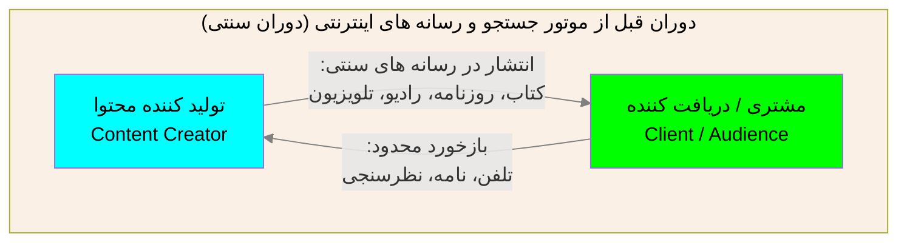
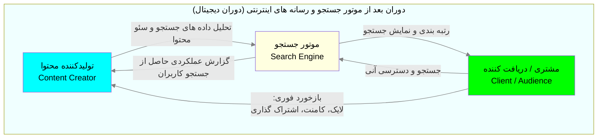

# 🔎پشت صحنه موتور های جستجوگر عظیم، چگونه در کسری از ثانیه در جهان کاوش می کنیم!🌐
بارها پیش آمده که با ابزارهای جستجوگر اینترنتی کار کرده باشید؛ بسیاری از ما امور اینترنتی خود را در همین ابزارها پیگیری می کنیم و فکر نمی کنم تا به حال شده باشد که حداقل هیچ کاری را بدون مرورگرهای جستجو انجام دهیم فرقی نمی کند چه کاری داریم یا چه سنی داریم، در هر صورت و در هر مکان و زمانی کم و بیش از این ابزارها استفاده می کنیم با مرورگرهایی که واسطه کار با این موتور های جستجو هستند، مانند: گوگل کروم (Google Chrome) مایکروسافت بینگ (Microsoft Bing) موزیلا فایرفاکس (Mozilla Firefox) مرورگر وب اپرا (Opera Web Browser) و ... اینکه چگونه در میان جهان اطلاعات به این وسعت، با میلیاردها صفحه وب و مطالب مختلف اعم از متن و عکس و فیلم و ... موتورهای جستجویی وجود دارند که از میان تمام ان صفحات و دادهها، تعداد مشخصی را برایمان گرداوری و پیشنهاد می کنند و ما از بین انها بر روی تعدادی کلیک کرده و مطالعه می کنیم، خود می تواند سفری پر هیجان و همزمان چالش برانگیز باشد.

ممکن است تصور کنیم این ابزارها با ظاهر ساده و کادر های مستطیلیشان چیزی شبیه به یک دکمه جادویی هستند: عبارتی را در قسمت نوار جستجو (search bar) مرورگر تایپ می کنیم، بر روی دکمهٔ جادویی جستجو (search) کلیک می کنیم و در کسری از ثانیه به هر انچه که می خواهیم می رسیم، شاید به ذهنمان خطور نکرده باشد تا درباره شان مطالعه کنیم و یا از خود بپرسیم: این نتایج از کجا می ایند؟ چگونه این نتایج می ایند؟ اصلا چطور با این سرعت و با این شکل نتایج ظاهر می شوند؟!

بنابراین با این همه استفاده کننده ای که از اینترنت داریم که اغلب هم به دنبال دریافت و یا اشتراک گذاری محتوا و مطلب هستند - تصور کردن این که چگونه در این اقیانوس بسیار پهناور اینترنت بتوانیم داده ها مطالب مورد نظر خود را پیدا و جستجو کنیم (هدف ما این است که می خواهیم بر روی فرایند یافتن اطلاعات در جهت دریافت ان تمرکز کنیم) در پشت این برنامه های جستجوگر به ظاهر ساده و مستطیلی خلاصه می شود که البته همه چیز هم به سادگی یک دکمه تمام نمی شود! در واقع موتور های جستجوگر یکی از پیچیده ترین و عظیم ترین فرایند های مهندسی کامپیوتر و داده کاوی در اینترنت هستند اما قبل از اینکه برسیم به موتور های جستجوگر یک سوالی بنیادین در این بین جا می ماند:

## ❔سوال: چرا موتور جستجو؟! چرا موتور؟ به طور مثال چرا به ان سرویس جستجوگر، برنامه جستجوگر، کتابخانه جستجو و یا از این دست اسامی ... نمی گوییم؟
موتور های جستجو گر خود نوعی سرویس محسوب می شوند (سرویس ها هم خود نیز نوعی برنامه کامپیوتری هستند) اما در کل با نام موتور جستجوگر یا search engine مطرح می شوند و انها را میشناسیم -> در واقع این نامگذاری چیزی به جز یک استعاره تمیز اما هوشمندانه از دوران ماشین های صنعتی نیست! به نوعی صفحات وب سوخت این موتور جستجو هستند و خود این فرایند (یعنی از کلیک کاربر بر روی search تا نحوه جمع اوری و نمایش اطلاعات) همانند یک موتور احتراقی مرحله به مرحله و چرخه ای است به همین دلیل با این استعاره به انها موتور جستجو می گوییم.

برخلاف دفترچه ها و کتابخانه های جستجو ابتدایی چه به صورت ایستا و چه پویا (یعنی حتی اگر قابلیت به روز شدند را هم داشتند) نتیجه انها همواره ثابت و قابل پیشبینی بود یعنی به طور مثال اگر شما بخواهید در مورد یک چیزی که اولش با کلمه b شروع می شود، جستجو را انجام دهید با یک ترتیب از پیش تعیین شده (مثالا ترتیب الفبا یا ...) نتایج مرتب و به شما تحویل داده می شد -> درست است که جستجو کردن و یافتن نتیجه در نهایت انجام می شود، اما همیشه در بهترین زمان و با بیشترین کیفیت نتایج برای شما مرتب نمی شوند! (یعنی ممکن است کاربران ان چیزی را که دقیقا می خواهند را پیدا نکنند) و دقیقا به همین خاطر به ان موتور گفتند زیرا در درجه اول عملکرد ان چرخه ای مانند و شبیه به موتور های احتراقی بود (که در ادامه به ان می رسیم) و در درجه دوم اینکه نتایجی که از ان حاصل می شد مستقیما به داده هایی ارتباط داشت که موتور جستجوگر ان ها را دریافت می کرد -> یعنی حساس به کیفیت داده های ورودی است، این دو فرق اساسی باعث شد که به این سرویس های جستجوگر -> موتور جستجوگر بگویند و نام انها بدین شکل مطرح شود.

📌به دلیل حجم بالا مطالب عمومی قصدی برای توضیح تاریخچه و منشا به وجود امدن موتور های جستجو را نداریم اما تنها یک عکس خط زمانی (time line) از تاریخچه جستجو را قرار داده ایم تا در حد مختصر در قالب یک عکس با تاریخچه موتور های جستجو اشنا شوید.


چنین عکسی مورد انتظار است❗

📍این مطالب مختصری از تاریخچه موتور های جستجو گر بودند، شما را کمی با تاریخ ان ها اشنا کنیم تا اینکه در نهایت به تغییر و انقلاب اصلی موتور های جستجوگر برسیم، البته اگر کنجکاو هستید و اشتهای شما تازه باز شده! می توانید جهت اشنایی و مطالعه تقریبا کامل تاریخچه به صفحات زیر یک نگاهی بیاندازید:

🧷link: https://audits.com/seo/insights/history-of-search-engines

🧷link: https://sebomarketing.com/brief-history-of-search

🧷link: https://en.wikipedia.org/wiki/search_engine

🧷link: https://en.wikipedia.org/wiki/timeline_of_web_search_engines

## انقلاب موتور های جستجوگر، هنگامی که گوگل قوانین این بازی را از نو نوشت
با نزدیک شدن به اواخر دهه 90 میلادی، اینترنت و وب به قدری بزرگ شده بود که موتورهای جستجوی متکی بر کلمات کلیدی (keyword-based) و دایرکتوری های انسانی (مثل yahoo directory) تقریبا فلج شده بودند! به طور مثال اگر شما کلمه "دانشگاه" را جستجو می کردید، موتور های جستجو آن دوره نمی دانستند که ایا سایت رسمی دانشگاه هاروارد را نشان دهند یا وبلاگ یک دانش اموز را که کلمه "دانشگاه" را 10 بار در آن تکرار کرده بود، در اینجا بود که این مشکل در سال 1998 توسط لری پیج (larry page) و سرگی برین (sergey brin) حل شد، در ابتدا آن ها نام پروژه خود را "backrub" گذاشته بودند زیرا موتور جستجوگر آن ها لینک های پشتیبانی سایت ها را بررسی می کرد و بر همان مبنا نیز میزان اهمیت آن ها را در نتایج جستجو تعیین می کرد، تقریبا در همان زمان با تکمیل موتور جستجو هم شرکت گوگل (google) با ان متولد شد و نام ان موتور جستجو جدید را گوگل گذاشتند، گوگل با اختراع الگوریتم جدیدی به نام رتبه بندی صفحه یا page rank به جای شمردن و جستجو در میان کوهی از کلمات، به "اعتبار" سایت ها نگاه می کرد البته به طور هوشمندانه ای و بر اساس نگاه کردن بر روی لینک های ورودی خود، با ورود گوگل به دنیای موتور های جستجو صفحه اصلی شلوغ اینترنت با یک صفحه کاملاً سفید و یک لوگوی رنگی معروف جایگزین شد و عصر پر جنب و جوش موتور های جستجوی اولیه را به پایان رساند، اغراق نیست اگر فکر کنیم یه جورایی گوگل مفهوم موتور های جستجو گر را به بلوغ خود رساند؛ موتور جستجوگری که قادر است در میان حجم عظیمی و غیر قابل تصوری اطلاعات دقیقا انچه را می خواهید پیدا کنید و به شما بدهد.

💡سوال میلیون دلاری و چالش همیشگی شرکت های توسعه دهنده در رابطه با موتور های جستجوگر همواره این بود که چگونه بتوانیم در مدت زمان کوتاهی در میان حجم بسیار عظیم داده ها جستجویی دقیق و هوشمندانه انجام دهیم که گوگل این مشکل را سرانجام حل کرد.

📍شرکت گوگل نام خود را از یک واژه ریاضی به نام googol که معادل عدد 1×10^100 است قرض گرفته و با کمی تغییر به نام google تبدیل کرد.

📍همزمان با گوگل در سال 1998 یک موتور جستجوگر دیگری هم متولد شد این بار از سمت شرکت microsoft با نام موتور جستجوگر شبکه ماکروسافت یا microsoft network search که به اختصار ان را با نام MSN search میشناسیم، ما ها نیز با ان اشنایی و خاطره داریم این موتور جستجو بعدا پیشفرض مرورگر خاطره انگیز internet explorer شد که در سال 1995 متولد شد و پس از 25 سال در سال 2020 بازنشت شد و رسما عمر و راه خود را به مرورگر edge داد، اما هسته موتور جستجوی ان همچنان MSN search engine باقی ماند و البته امروزه هم جایگاهی خوبی دارد.

## نگرشی کوتاه به اینده⌛
با ورودی هوش مصنوعی به جای جای جهان مدرن ما این سوال برایمان مطرح می شود که اینده موتور های جستجو گر به چه صورت می شود؟! همان طور که گوگل با طراحی الگوریتم های دقیق تر و هوشمند تر خود به دوران موتور های اولیه جستجو در دهه 90 پایان داد، با ظهور هوش مصنوعی های مولد (generative ai) همانند ابزارهایی مانند chatgpt که زیاد هم هستند، در حال شکل دهی مفهوم جدیدی از جستجو هستند یعنی به جای اینکه دانه دانه دنبال اطلاعات بگردیم ان را را به هوش مصنوعی بسپاریم و در لحظه بتوانیم مثالا 10-20 تا از صفحات و اسناد و مطالب دیگر را در یک چشم به هم زدند مطالعه کند و ترکیب و خلاصه ای از انها را به عنوان نتیجه برگردانند و به ما تحویل دهد، البته موتور های جستجوی که مبتنی بر هوش مصنوعی هستند هنوز کار و فضا برای پیشرفت دارند، اما سوال مهم این است که ایا امروز هم همانند گذشته در آستانه یک تغییر پارادایم (الگو) دیگر است؟ یا صرفا در نهایت هوش مصنوعی به یک مکمل خوب برای ان تبدیل می شود؟

# ♒جریان موتور جستجو (search engine flow) چیست؟
❗قبل از شروع: در این متن تلاش شده از بیان مطالب سنگین و عمیق شدن در این حوزه پرهیز شود تا مطالب برای دانشجوهای رشته های دیگر (انسانی، هنر، علوم پایه و فنی مهندسی و ...) قابل فهم و کاربردی تر باشد و از سوی دیگر، به ما دیدگاه هایی در رابطه با اقتصاد و اجتماع دهد تا درک کنیم چرا رتبه بندی این صفحات، به شریان های حیاتی کسب و کار های امروزی تبدیل شده و در صورت اختلال ان چه اسیب های سنگینی به جامعه آنلاین وارد می شود، در اخر هم برای کاربردی تر بودن این مطالب راه هایی را به شما معرفی می کنیم تا بتوانید جستجویی بهتر و دقیق تری داشته باشید.

📌نکته مهم: دانستیم برخلاف کتاب های کاغذی موجود در یک کتابخانه، اطلاعات و صفحات موجود در اینترنت در یک مکان ثابت و به صورت ایستا نیستند و در یک بشکن ثانیه ای، هزاران صفحه وب در ابعاد جهان تولید، ویرایش، جابه جا و از بین می روند، همچنین اطلاعات و صفحات اینترنتی و وب به صورت قفسه بندی شده و مرتب هم نیستند، درواقع صفحات اینترنتی و وب شناور و دائما در جریان هستند (یعنی اینگونه نیست که مثالا صفحات اقتصادی در یک سرور هستند و مطالب مربوط به صفحات تجاری در یک سرور دیگر! تمام صفحات و اطلاعات در تمامی مراکز پردازش داده ای در سرتاسر جهان پخش و در هم تنیده هستند)

📌همچنین در حال حاظر به استناد سایت www.siteefiy.com در جهان براورد شده که به صورت تقریبی 1.5 B وب سایت در جهان وجود دارد و از این تعداد چیزی در حدود 217 M تای ان به صورت روزانه فعال و به روز هستند که می توانید ان را از لینک زیر مشاهده نمایید:

🧷link: https://siteefy.com/how-many-websites-are-there

برای اینکه موتور جستجو بتواند در این آشفتگی، پراکندگی و حجم بالای اطلاعاتی، همان چیزی را که به دنبالش هستیم را به ما نشان دهد، بایستی از یک چرخه جریان اطلاعات (information flow cycle) منظم پیروی کند؛ این چرخه در واقع مسیر سفر داده ها در درون یک موتور جستجو است، که میان سه جایگاه اصلی در محتوا در جریان است:





جریان موتور جستجو یعنی روندی که یک موتور جستجو از دنبال کردن صفحات اینترنتی وب که برای یافتن، سازماندهی و ارائه نتایج مد نظر کاربران ان را طی می کند، این فرایند یک فرآیند گام به گام و مرحله به مرحله است و اگر بخواهیم مراحل اصلی که در این فرایند طی می شود را به صورت خلاصه و مختصر تشریح کنیم، کار یک موتور جستجو در سه فاز اصلی خلاصه می شود که به صورت مداوم و پشت سرهم در حال اجرا  هستند:


همچین عکسی مد نظر است❗

## 1.خزیدن (crawling) ربات های خزنده -> مانند جستجوگران خستگی ناپذیر هستند🕵🏻
صفحاتی وبی که تازه تولید شده یا بروز شده (حتی در مواردی صفحات قدیمی) توسط ربات های خزنده (crawler) و ربات های عنکبوتی (spider) کشف می شوند -> ربات های crawling و spidering که برای یافتن انواع صفحات وب طراحی شده اند با دنبال کردن ابر لینک ها (hyper link) و مسیر های ارتباطی مرتبط به هم (شبیه به یک شبکه گراف بزرگ و متصل به هم) از صفحه ای به صفحه دیگر می روند و کدها و محتوای خام صفحات وب را پیدا کرده و دانه دانه انها را در یک پایگاه داده یا یک مخزن اطلاعات صرفا ذخیره می کنند (یا اصطلاحا fetch = دریافت می کنند)

📍به زبان ساده: فرض کنید کتابخانه ای بزرگ داریم که هر روز هزاران کتاب جدید به آن اضافه می شود، موتور جستجو مامورانی (ربات هایی) را استخدام کرده تا دائم در شهر بچرخند و کتاب های جدید را پیدا کنند.

📌دلیل اینکه به بعضی ربات های خزنده عنکبوتی گفته می شود و به این نام معروف شده اند، بخاطر این است که انها همانند یک عنکبوت از طریق پیوندها و ابر لینک ها از یک صفحه به صفحات دیگر میپرند در واقعا انها کار مشابهی در مقایسه با خزندگان (crawler) ها انجام می دهند به همین دلیل معمولا مترادف هم شمرده می شوند.

📌نکته: محتوا های خام صفحات وب که خزنده ها به دنبال انها هستند عموما شامل داده های HTML موجود در صفحات وب است.

📌گوگل یک ابزار خوب برای کسانی که یک سایت دارند در اختیار گذاشته با نام URL inception tool تا شما بتوانید زمان و نتیجه خزیده شدن سایت خود یعنی زمانی که ربات های خزنده گوگل سایت شما را دریافت می کنند را ببینید (البته این ابزار اطلاعات بسیار بیشتری نیز در اختیار شما قرار می دهد)، این تصویر را به کمک یکی از دوستان انجمن اقای محمد مهدی نقیان تهیه کرده ایم (این تصویر به ما نشان می دهد که این صفحه وب در چه تاریخی خزیده شده و ربات های خزنده گوگل این صفحه وب را به عنوان یک دستگاه تلفن هوشمند را برسی کرده و در نهایت مورد تایید برای نمایه سازی شده)

محل درج عکسی که با کمک نقیان گرفتیم❗

(این تصویر نشان میدهد که این صفحه وب در چه تاریخی خزیده شده و ربات های خزنده گوگل این صفحه وب را به عنوان یک دستگاه تلفن هوشمند را برسی کرده و در نهایت مورد تایید برای نمایه سازی شده)

## 2.نمایه سازی (indexing) الگوریتم های نمایه سازی -> مانند یک کتابدار بزرگ هستند📚
پس از کشف صفحات توسط بات ها، نوبت به ذخیره و سازماندهی انها در پایگاه های داده عظیم موتور جستجو می رسد، در این مرحله محتوای هر صفحه طبق موضوعی که دارند دسته بندی و تحلیل می شود: یعنی موضوع ان صفحه، اعتبار آن، متادیتا های ان (اطلاعات پس زمینه موجود در صفحات)، کلیدواژه ها و ساختار لینک های داخلی آن بررسی می شوند و همچنین کلمات به همراه موقعیت دقیقشان در صفحه وب بایگانی می شوند تا وقتی کاربر عبارتی را سرچ کرد، موتور جستجو بتواند در کسری از ثانیه تمام این بایگانی نظم یافته را جستجو کند (بنابراین مهم است دقت کنیم که کل اینترنت جستجو نمی شود، بلکه در واقع کپی از صفحات نمایه سازی ذخیره شده، جستجو می شود)

📍به زبان ساده: اگر کتاب های کشف شده بدون نظم روی هم انباشته شوند، پیدا کردن یک مطلب تقریبا غیرممکن و سخت می شود، در اینجا است که یک کتابدار بزرگ، تمام کتاب ها را می خواند، موضوع بندی می کند و در قفسه های مشخص می چیند.

## 3.رتبه بندی (ranking): الگوریتم های رتبه بندی -> مانند ویترینی از بهترین پاسخ ها هستند✨
زمانی که شما عبارتی را سرچ می کنید، الگوریتم رتبه بندی های پیچیده وارد عمل می شوند، انها صفحات نمایه سازی (index) شده را بر اساس ده ها فاکتور مختلف ارزیابی و رتبه بندی می کنند، تا مرتبط ترین و باکیفیت ترین نتایج (از نظر ان الگوریتم) در همان خطوط ابتدایی صفحه اول جستجو برای شما ظاهر شوند.

📍به زبان ساده: وقتی شما از کتابدار درباره یک موضوعی «به طور مثال بهترین روش مدیریت سرمایه» کتاب می خواهید، او صدها کتاب موجود را بر اساس اعتبار نویسنده، کیفیت چاپ و میزان رضایت دیگران مرتب می کند و بهترین ها را اول به شما می دهد.

📌نکته پر اهمیت: در بین مراحل نکته ظریفی که وجود دارد این است که فرایند خزش (crawling) و نمایه سازی (indexing) همیشه در حال انجام است، حتی وقتی شما خواب هستید! اما رتبه بندی تنها در لحظه ای که شما سرچ می کنید، مختص به شما اتفاق می افتد و الگوریتم های رتبه بندی در همان کسری از ثانیه، بهترین نتیجه را از بین میلون ها و میلیاردها صفحه ای که نمایه سازی شده اند، بر می گزیند و به شما نمایش می دهند.

📌یک کاربرد در صنعت: احتمالا اصطلاح SEO یا بهینه سازی برای موتور های جستجو (search engine optimization) را شنیده اید، کار یک متخصص سئو دقیقاً همین است؛ او ساختار و محتوای سایت یک سازمان و شرکت را طوری تنظیم و معتبر می کند که ربات های گوگل یا موتور های جستجوگر دیگر به راحتی آن را کشف یا به اصطلاح (crawl) کنند و به درستی ان را نمایه سازی (indexing) کنند در نهایت هم به ان صفحه وب رتبه (rank) بالاتری اختصاص بدهند تا زودتر جلو چشم کاربران بیاید، این کار همچنین در فعالیت های صنعت و اقتصاد مانند بازاریابی دیجیتال (digital marketing) و برندسازی (branding) بسیار مهم و حیاتی برای شرکت ها و سازمان ها تلقی می شود.

# نگاهی دقیق تر به این فرایند: نحوه گردش اطلاعات میان سه جایگاه اصلی در موتور های جستجوگر🔄
علاوه بر مراحل اصلی که جنبه کلی قضیه را توضیح داده بودیم - اگر بخواهیم دیدگاه دیگر و فنی تری به این فرآیند داشته باشیم یعنی بر اساس نحوه تبادل اطلاعات از مبدا به مقصد و چرخش ان بین مسیر دیدگامان را معطوف کنیم، همانطور که از مطالب قبل فهمیدیم جریان موتور جستجو یک جاده یک طرفه نیست؛ بلکه یک چرخه اطلاعاتی مداوم و پویاست که میان سه جایگاه اصلی در حال تبادل اطلاعات است -> جریان اطلاعاتی که بین 1.موتور جستجو | 2.کاربران | 3.تولیدکنندگان محتوا دائما در جریان و چرخش است، حال برای این ارتباط متقابل را می توان در 4 جریان گردش اطلاعاتی که بعضی یک طرفه و بعضی نیز چرخه ای هستند (به طور کلی اما این فرایند یک چرخه پویا و دائم بروز شونده است) توضیح داد:


(انیمیشنی دقیق از شرح و عملکرد کامل یک موتور جستجو به استناد سایت: [www.bytebytego.com](http://www.bytebytego.com))

چنین عکسی مورد انتظار هست❗

## 1.خزیدن در میان صفحات وب و جمع اوری انها (crawling & collection)
ربات های خزنده و عنکبوتی ابتدا شروع به جمع اوری لینک های در صفحات مختلف می کند (مثالا 1 میلیون صفحه وب را لینک هایش را جمع اوری می کند) سپس انها را از نظر زمانی اولویت بندی می کند (مثالا برای یک هفته، تا تکراری یک صفحه را نگردد) و انها را اماده خزیده شدن می کند – سپس ربات های خزنده بر اساس ادرس URL یا مکان یاب یکنواخت منبع (uniform resource locator) که دریافت و اولویت بندی کرده شروع به خزیدن ان می کند، یعنی اطلاعات خام ان صفحات وب که معمولا داده های HTML صفحات وبی هستند را می خواند و بدون اینکه پردازش پیچیده ای روی انها انجام دهد، در یک پایگاه داده (data base) یا یک مخزن اطلاعات (information repository) ذخیره می شوند.

📌URL به زبان ساده همان ادرس عمومی صفحه ای هستش در وب به دنبال ان هستید، به طور مثال: www.digikala.com چون وب سایت ها در حقیقت با ادرس های IP ادرس دهی می شود و به این شکل در واقع نیستند.

## 2.تجزیه و نمایه سازی (parsing & indexing)
تجزیه کننده ها (parser) پایگاه داده یا مخزن اطلاعاتی صفحات خزیده شده را کالبدشکافی می کنند، یعنی متون اصلی، برچسب ها (tags)، تصاویر، فراداده ها (meta data) و لینک ها را از هم تفکیک و جدا می کنند سپس نمایه ساز ها (indexer) این اطلاعات تفکیک شده از تجزیه کننده ها پردازشی انجام می دهند به طور مثال یکی از پردازش ها می تواند این باشد که در هر صفحه وب چه کلمه ای در کدام صفحات وب با چه تکرار و موضوعی وجود دارند و پردازش های دیگر... بدین ترتیب صفحات نمایه سازی (index) شد و مجدد در یک پایگاه داده (data base) یا مخزن اطلاعات (information repository) برای جستجو شدن ذخیره می شوند.

## 3.رتبه بندی و ارزیابی صفحات (ranking system)
وقتی کاربر یک عبارت جستجو (search query) که همان سوال و درخواست کاربر است که به موتور جستجو می دهد که به این کار کاربر جستجو کردن (searching) می گوییم، ممکن است هزاران صفحه نمایه سازی (index) شده وجود داشته باشند که به نتیجه مرتبط باشند، این بخش دقیقا تعیین می کند که چه صفحه ای در صدر نتایج قرار داشته باشد – الگوریتم های رتبه بندی (که یکی از انها الگوریتم معروف page rank گوگل است) فاکتور های مهمی نظیره کیفیت محتوا، ارتباط کلمات، اعتبار و ارزش دامنه، تعداد و کیفیت لینک های وارد شده در صفحه وب، سرعت بارگذاری صفحه وب، سازگاری صفحه وب با دستگاه تلفن هوشمند و دستگاه های لمسی و ... را برسی و مقایسه می کنند و طبق امتیازی که هر صفحه وب گرفته، انها را به ترتیب نزولی (اولین صفحه بیشترین امتیاز ← اخرین صفحه کمترین امتیاز) مرتب می کند و به شما نمایش می دهد.

📍یعنی یه جورایی این همه برنامه نویس، متخصص SEO و تحلیلگر بازار و ... دقیقا سعی می کنند که طوری صفحات خود را طراحی و بنویسند تا از این سیستم رتبه بندی (که در نهایت خود نیز نوعی برنامه کامپیوتری است) امتیاز بالاتری گیرند!!!

📌موضوع مهم میان ان این است که فرایند رتبه بندی صفحات تنها به این معیار ها محدود نمی شود و چرخه در همین جا به پایان نمی رسد بلکه بازخورد و رفتار کاربران (feedback & behavior) مانند زمان ماندن شما در صفحه وب (dwell time)، نرخ کلیک (CTR = click through rate) شما در ان صفحه و ... به عنوان علایم بازخوردی به موتور رتبه بندی باز می گردند تا به مرور الگوریتم های رتبه بندی را حتی هوشمند تر از قبل کنند، یعنی به نوعی موتور جستجو دائم نحوه رفتار و تعامل کاربران با نتایجی که از الگوریتم های رتبه بندی تولید شده را زیر نظر می گیرد و بر اساس همین رفتارها و بازخورد های کاربران به صفحات وب، رتبه بندی صفحات وب خود را مدام به روزرسانی می کند، تا نتایج یافت شده بهتر، دقیق تر و سریع تر شود به همین دلیل رفتار و بازخورد شما نکته جالب این ماجرا است و برای شرکت ها اهمیت زیادی دارد، چرا که منجر به شناخت بهتری از شما می شوند تا بتواند مطالب مرتبط تر و تبلیغات مرتبط تری برای شما پیدا کنند، البته که چالش های حقوقی هم در کنار ان وجود دارد چرا که این اطلاعات می تواند به شرکت های دیگر هم فروخته شوند یا حتی دزدیده شود.

## 4.رابط کاربری و پردازش پرس و جو (user interface & query engine)
رابط کاربری دقیقا محل نقطه تماس کاربر با این سیستم موتور جستجو است جایی که شما در مرورگر خود جستجو (search) می کنید و نتایج را مشاهده می کنید، ابتدا کاربر که شما باشید عبارت مورد نظر خود را در یک رابط کاربری مثل یک برنامه جستجوگر (search application) یا مرورگر (browser) وارد می کند، سپس موتور پرس و جو (query engine) عبارت ورودی که کاربر به مرورگر داده را اصلاح و پردازش می کند (مثالا غلط گیری املایی، ریشه یابی جمله و کلمات، پیدا کردن  کلمات مترادف و ... را انجام می دهند) و به سیستم رتبه بندی (ranking system) صفحات می فرستد و در نهایت نتایج مرتبط با عبارت جستجو که صفحات وب رتبه بندی شده هستند، در قالب یک صفحه به نام صفحه SERP یا صفحه نتایج موتور جستجو (search engine result page) به کاربر نمایش داده می شوند؛ البته نتایج می تواند چندین صفحه باشند اما منظورمان صفحه ای است که کاربر درون رابط کاربری خود مشاهده می کند.

# ◀️منبع ارجاع مطالب علمی:
🧷link: https://lucidly.ae/blog/seo/how-search-engines-work -> for general

🧷link: https://developers.google.com/search/docs/fundamentals/how-search-works -> for intermediate

🧷link: https://bing.com/webmasters/help/webmaster-guidelines-30fbB23a -> for intermediat

# 🧶 وقتی رشته های ارتباطی پنبه می شوند! سایه سنگین قطع اینترنت و سقوط ازاد SEO📉
تا اینجای کار همه چیز مثل یک ساعت دقیق کار می کند؛ اما چه می شود اگر این جریان اطلاعاتی دچار اختلال شود؟! یکی از ملموس ترین مثال ها برای درک اهمیت این ساختار، آسیب های شدیدی است که در جریان قطعی سراسری اینترنت (3 ماهه) به بدنه جامعه آنلاین و کسب و کار های اینترنتی ما وارد شد، وقتی اینترنت به صورت سراسری و شدید قطع می شود، ارتباط میان ارکان این شبکه و چرخه از هم گسسته می شود و نتیجه ان می شود که:

## 1.افت رتبه و اعتبار جهانی صفحات وب در سطح بین الملل
ربات های خزنده وقتی با درهای بسته مواجه می شوند، فرض می کنند که سایت های ایرانی خراب یا از دسترس خارج شده اند (چون نمی توانند ان را crawl کنند)، به همین دلیل به مرور زمان رتبه اعتبار و ارزش دامنه (domain authority) صفحات وب را در سطح بین المللی کاهش می دهند.

❗نکته ای که ممکن است فراموش شود: این معیار های سنجش از موتور های جستجوی داخلی نیستند! بلکه توسط موتورهای جستجوی جهانی سنجیده می شود، به دلیل ماهیت همه شمول بودن و جهانی بودن موتور های جستجو بین المللی، انها ساختار اصلی وب را هدایت می کنند، به همین دلیل است که ارتباطات جهانی را نمی شود داخلی سازی کرد می توان به ان کمتر وابسته بود اما حذف کردن ان مشکل زا است.

## 2.خسارت های مالی سنگین به شرکت ها و سازمان ها
ساختن یک وب سایت معتبر، فرایندی بسیار زمان بر و هزینه بر است، سازمان ها و شرکت ها سال ها زمان، انرژی و هزینه های کلانی را صرف تیم های تخصصی سئو، بازاریابی و تبلیغات و برند سازی می کنند تا بتوانند صفحات خود را به خطوط اول موتور های جستجو برسند، قطع شدن این چرخه از ریشه که به سادگی یک دکمه است، یعنی نابودی زحمات چندین ساله و از دست رفتن اعتباری که به سختی جمع اوری شده بود، اتفاقی که مستقیما به شرکت ها خسارت های مالی عمده و جدی ای وارد می کند.

📌به همین دلیل این موضوع اهمیت دارد که بدانیم اینترنت فقط ابزاری برای سرگرمی نیست -> اینترنت یعنی ارتباط و تئامل با جهان (ماهیت واژه ان هم همین را می گوید) اینترنت به انگلیسی internet ترکیب و اختصار یافته از دو واژه interconnected network است به معنای شبکه به هم پیوسته (یعنی به هم متصل)؛ کسب و کارهای اینترنتی و هر نوع فعالیتی که هدف ان جهانی است برای دیده شدن، وابستگی الزامی و حیاتی به اینترنت و این چرخه دارد.

## 🧐اما در نهایت چرا درک این فرآیند ها برای همه ما مهم است؟
در نهایت، ممکن است از خودمان بپرسیم که چرا اصلا دانستن این همه مطالب و جزئیات برای افراد یا دانشجویانی که رشته شان کامپیوتر نیست مهم باید باشد

📌درک چرخه و جریان اطلاعات در موتور جستجو گر، صرفا یک بحث فنی برای متخصصان کامپیوتر نیست! (شاید اینگونه در ابتدا به نظر نرسد) اما دانستن اینکه یک موتور جستجو چگونه کار می کند، می تواند به ما چه مستقیم و چه غیر مستقیم کمک کند تا به عنوان یک فرد مفید در جامعه و یا یک دانشجویی که به دنبال دانش هستیم، به جستجوگران بهتر و دقیقتری تبدیل شویم و منابع معتبر تر یا علمی را سریع تر و دقیق تر پیدا کنیم یا اینکه حداقل بدانیم کسانی هستند که با نواوری ها، ابداعات همراه تلاش و دست رنج خود نه تنها به خود و جامعه خود بلکه به بشریت کمک می کنند.

### 1.طراحی وب سایت های هوشمند تر:
با دانستن نحوه کشف و رتبه بندی صفحات توسط موتورهای جستجو، می توان وب سایت ها را به گونه ای طراحی کرد که هم برای کاربران و هم برای موتورهای جستجو جذاب تر و بهینه تر باشد (موضوعی که به خصوص برای دانشجویان کامپیوتر جذابیت فنی دارد البته صرفا در این نشریه مختصریی از ان اورده شده اما می تواند شروع و انگیزه خوبی باشد)

### 2.جستجوی دقیق تر و فنی تر:
درک این فرآیند به شما کمک می کند تا در پروژه های دانشگاهی و تحقیقاتی خود، جستجوهای دقیق تری انجام دهید و نتایج بسیار بهتری دریافت کنید.

### 3.ارتقای سواد دیجیتال:
داشتن دانشی مختصر از این فرآیند، یک نمای کلی و ارزشمند از نحوه عملکرد یکی از اساسی ترین و پراستفاده ترین فناوری های دنیای مدرن را به شما می دهد.

📍وظیفه ما: در این بین وظیفه داریم اگاه باشیم و نگذاریم موضوعات مهم در جامعه اشتباه به کار روند و از نا اگاهی ما سوء استفاده شود.

# 🛠️از تئوری تا عمل: ترفند هایی برای جستجویی حرفه ای تر
در پایان این مطالب حیف است که پس از این همه توضیح دادن و حوصله سر بردن شما کار عملی برای شما نداشته باشیم به همین دلیل این بخش را برای شما اماده کرده ایم.

حالا که متوجه شدید موتور های جستجو چطور محتوا ها را کشف، دسته بندی، نمایه سازی و رتبه بندی می کند، چطور می توانیم از این دانش برای کارهای دانشگاهی و پروژه های خود یا برای یک جستجوی ساده استفاده کنیم؟ با استفاده از فرمول های جادویی زیر که به ان ها "search operators" یا عملگر های جستجو می گوییم، اغلب موتور های جستجو گر مطرح مانند: google, bing, etc. از چنین عملگر هایی پشتیبانی می کنند، با استفاده از این عملگر ها می توانیم به جای سردرگم شدن در صفحات وب حتی با وجود اینکه موتور جستجو سعی می کند مرتبط ترین نتایج را برای ما پیدا کند، دقیقا به هدف بزنیم.

📍البته مرورگر های ابزار هایی را برای همین منظور دارند برای مثال در موتور جستجوی گوگل از قسمت tools و در ادامه قسمت advance search در مرورگر می توان یک جستجو پیشرفته انجام دهید اما خب به احتمال زیاد از همان اول کار با ان حسابی گیج شوید و زود ان را رها کنید.

📍این ترفند هایی که در ادامه توضیح داده ایم بر روی موتور جستجوگر گوگل برسی شده ممکن است در موتور های جستجو گر دیگر به این شکل نباشد و یا دارای تفاوت هایی باشد.

## • **جستجوی دقیق یک عبارت**
با استفاده از نماد نقل قول " " (quotation) می توانیم یک "(عبارت مورد نظر)" را به صورت دقیق جستجو کنیم، بدین صورت که: در ابتدا یک علامت نقل قول (") را در قسمت search bar مرورگر خود وارد کنید سپس عبارت مورد نظر خود را تایپ کنید در انتها عبارت یک علامت نقل قول (") دیگر هم به ان اضافه کنید، به طور مثال:

**search bar:**

```text
"هوش مصنوعی در پزشکی"
```

با این کار موتور جستجوگر فقط به دنبال صفحاتی می گردد که این عبارت دقیقا به همین صورت و پشت سرهم در تیتر صفحه امده باشد.

## • **جستجو در یک سایت مشخص**
اگر می خواهید که عبارت جستجو شما فقط محدود به صفحات یک سایت مشخص شود، بایستی از عملگر site: استفاده کنیم، بدین صورت که: متن جستجو را در قسمت search bar مرورگر خود تایپ کنید و با یک فاصله، در انتهای ان به انگلیسی عبارت site:example.(your website domain suffix) را اضافه کنید، به طور مثال:

**search bar:**
```
کارشناسی ارشد site:sanjesh.org
```

با این کار موتور جستجوگر فقط از سایت sanjesh.org صفحاتی را با عبارت کارشناسی ارشد جستجو می کند.

## • **جستجو یک نوع فایل خاص**
برای پیدا کردن جزوه، کتاب، مقاله یا فایل های word, excel, power point و ... بسیار کاربردی است، برای این کار بایستی از عملگر filetype: استفاده کنید، بدین صورت که: متن جستجو را در قسمت search bar مرورگر خود تایپ کنید و با یک فاصله، در انتهای ان به انگلیسی عبارت filetype:example_format را اضافه کنید، به طور مثال:

**search bar:**
```text
کتاب قانون اساسی filetype:pdf
```

با این کار موتور جستجوگر از تمام صفحاتی که کتاب قانون اساسی دارند فقط به دنبال سایت هایی می گردد که در انها یک فایل pdf با این عبارت وجود داشته باشد.

## • **حذف کلمه مزاحم از جستجو**
گاهی در هنگام جستجو پیش می اید که نمی خواهید نتایج غیر مرتبط به عبارت شما نمایش داده شود برای این کار بایستی از عملگر – (تفریق) استفاده کنیم بدین صورت که: متن جستجو خود را در قسمت search bar مرورگر خود تایپ کنید و در انتهای ان نماد – را به همراه ان عبارتی که نمی خواهید موتور جستجو ان را جستجو کند را به ان اضافه کنید، به طور مثال:

**search bar:**
```text
خرید لامپ -led
```

با این کار موتور جستجوگر تمام صفحاتی که لامپ برای خرید دارند غیر از انهایی که عبارت led را دارند را برای شما جستجو می کند.

## • **جستجو در عناوین صفحات**
اگر می خواهید که کلمه مورد نظرتان حتماً در «تیتر اصلی» مقاله یا صفحه باشد، بایستی از عملگر intitle: استفاده کنید، بدین صورت که: متن جستجو خود را در قسمت search bar مرورگر خود تایپ کنید و با یک فاصله، در انتهای ان به انگلیسی عبارت intitle:example_query را اضافه کنید، به طور مثال:

**search bar:**
```text
مقاله های معتبر intitle:block chain
```

با این کار موتور جستجوگر عبارت شما را جستجو می کند اما فقط نتایجی را که شامل این عبارت block chain به همین صورت و پشت سرهم در محتوای صفحه آمده باشد را به شما نشان می دهد.

## • **پر کردن جاهای خالی عبارت**
اگر یک اصطلاح، بخشی از شعر یا عنوان مقاله ای را فراموش کرده اید، به جای بخش فراموش شده از عملگر * استفاده کنید، به طور مثال:

**search bar:**
```text
تئوری * در علوم کامپیوتر
```

با این کار موتور جستجوگر به دنبال صفحاتی می گردد که بیشتر تطابق متنی را با این عبارت جستجو دارد و ان ها را جایگزین * می کند.

## • **جستجو بین دو بازه عددی**
اگر می خواهید جستجوی شما معطوف به یک بازه عددی خاص از مقدار عددی، قیمت، سال و ... باشد، به طور مثال: خرید لپ تاپ 500 تا 1000 دلاری بایستی از عملگر .. (دو نقطه) استفاده کنید بدین صورت که: متن جستجو را در قسمت search bar مرورگر خود تایپ کنید هنگامی که خواستید مقدار دو بازه را وارد کنید بین دو عدد .. (دو نقطه) قرار دهید به طور مثال:

**search bar:**
```text
buy a business laptop 500..1000 dollars
```

با این کار موتور جستجوگر به دنبال صفحاتی می گردد که در ان نتایج بازه عددی مورد نظر شما هستند.

## • **جستجو نتایج قبل یا بعد از یک تاریخ مشخص**
برای اینکه جستجو شما معطوف به یک بازه از تاریخ مشخص باشد، به طور مثال: اخبار تکنولوژی قبل از سال 2026 بایستی از عملگر after: و before: استفاده کنید بدین صورت که: متن جستجو را در قسمت search bar مرورگر خود تایپ کنید سپس با یک فاصله، در انتهای ان به انگلیسی عبارت after:example_date یا before:example_date را اضافه کنید، به طور مثال:

**search bar:**
```
اخبار تکنولوژی before:2026-01-01
```

با جستجو این عبارت موتور جستجو تنها دنبال صفحات مرتبط به اخبار حوزه تکنولوژه می گردد که مربوط به قبل از سال 2026 باشد.

📌نکته: بین اپراتور و عبارت جستجو فاصله نگذارید به طور مثال: site: bbc.com غلط است و موتور جستجو ان را لحاظ نمی کند.

## • **ترکیب عملگرهای جستجو**
می توانید این عملگرها  را (با یک نیم فاصل بین هر عملگر) با هم ترکیب کنید که جستجوی شما را حتی دقیق تر و کاربردی تر می کند، به طور مثال:

**search bar:**
```text
"هوش مصنوعی در پزشکی" site:nature.com filetype:pdf after:2023-01-01
```

📍البته که این ها تمام عملگر های موتور جستجوگر نیستند ما پرکاربرد ترین عملگرها را برای شما اوردیم، اما در صورت نیاز شما می توانید برای یافتن عملگر های بیشتر یک نگاهی به سایت زیر بیاندازید:

🧷Link: https://ahrefs.com/blog/google-advanced-search-operators
